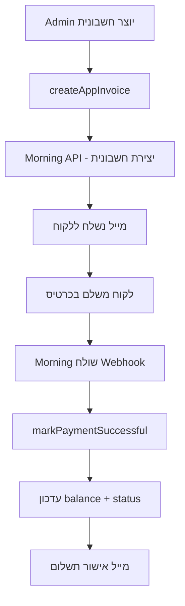
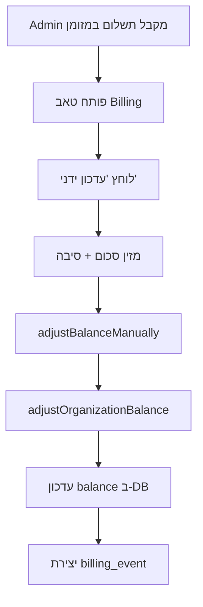

# 📊 ארכיטקטורת מערכת החיוב - Misrad-AI

> תיעוד מלא ומפורט של מערכת החיוב והבילינג במערכת Misrad-AI

---

## 🎯 סקירה כללית

מערכת Misrad-AI כוללת **2 רבדי חיוב נפרדים** שחשוב להבין את ההבדל ביניהם:

### 1️⃣ **רובד פלטפורמה (Platform Billing)**
**Misrad-AI → ארגונים**
- Misrad-AI מחייב את הארגונים עבור שימוש במערכת
- משתמש ב-**Morning (חשבונית ירוקה)** API
- חשבוניות נשלחות ללקוח העסקי (Business Client)
- ניהול דרך **פאנל Super Admin**

### 2️⃣ **רובד ארגוני (Organization Billing)**
**ארגון → לקוחות שלו**
- הארגון מנפיק חשבוניות ללקוחות שלו
- מנוהל דרך **מודול Finance** בתוך המערכת
- נתונים מאוחסנים ב-`invoices` table
- **לא קשור לתשלום למערכת**

---

## 📁 מבנה קבצים

### **Backend - Platform Billing**
```
lib/services/app-billing.ts                    # 🎯 ליבת החיוב
  ├─ createAppInvoice()                        # יצירת חשבונית Morning
  ├─ markPaymentSuccessful()                   # עדכון לאחר תשלום מוצלח
  ├─ markPaymentFailed()                       # טיפול בכשל תשלום
  └─ adjustOrganizationBalance()               # עדכון יתרה ידני

app/actions/app-billing.ts                     # Server Actions לאדמין
  ├─ generatePaymentLink()                     # יצירת קישור תשלום
  ├─ adjustBalanceManually()                   # עדכון ידני ליתרה
  ├─ getOrganizationInvoices()                 # שליפת חשבוניות
  └─ createOrganizationInvoice()               # יצירה ידנית

app/api/webhooks/morning-app/route.ts          # 🔗 Webhook של Morning
  ├─ document.paid                             # תשלום הצליח
  ├─ document.failed                           # תשלום נכשל
  └─ document.cancelled                        # תשלום בוטל
```

### **Frontend - User-Facing**
```
app/w/[orgSlug]/billing/
  ├─ page.tsx                                  # 🌐 דף ראשי לחיוב
  └─ BillingPortalClient.tsx                   # UI מלא - חשבוניות ויתרה

components/me/BillingSettings.tsx              # ⚠️ DEPRECATED - Modal ישן
```

### **Admin Panel**
```
components/admin/ManageOrganizationClient.tsx  # 🔐 ניהול ארגון
  └─ Tab: Billing
      ├─ MRR Display
      ├─ Balance Adjustment (manual)
      ├─ Trial Extension
      ├─ Invoice History
      └─ Payment Link Generation
```

---

## 🗄️ מבנה Database

### **Organizations**
```sql
CREATE TABLE organization (
  id UUID PRIMARY KEY,
  balance DECIMAL(10,2) DEFAULT 0,              -- יתרה נוכחית
  mrr DECIMAL(10,2) DEFAULT 0,                  -- הכנסה חודשית
  subscription_status VARCHAR,                  -- trial/active/cancelled/past_due
  billing_cycle VARCHAR,                        -- monthly/yearly
  next_billing_date TIMESTAMPTZ,
  last_payment_date TIMESTAMPTZ,
  last_payment_amount DECIMAL(10,2),
  ai_credits_balance_cents BIGINT DEFAULT 0,    -- קרדיטי AI
  billing_email VARCHAR,
  tax_id VARCHAR
);
```

### **Billing Invoices**
```sql
CREATE TABLE billing_invoices (
  id UUID PRIMARY KEY,
  organization_id UUID REFERENCES organization(id),
  morning_invoice_id VARCHAR,                   -- ID מ-Morning API
  invoice_number VARCHAR,
  amount DECIMAL(10,2),
  currency VARCHAR DEFAULT 'ILS',
  status VARCHAR,                               -- pending/paid/cancelled/overdue
  invoice_url VARCHAR,                          -- קישור לחשבונית
  pdf_url VARCHAR,                              -- קישור ל-PDF
  payment_url VARCHAR,                          -- קישור לתשלום
  description TEXT,
  email_sent BOOLEAN DEFAULT false,
  paid_at TIMESTAMPTZ,
  due_date TIMESTAMPTZ,
  created_at TIMESTAMPTZ DEFAULT NOW()
);
```

### **Billing Events (Audit Trail)**
```sql
CREATE TABLE billing_events (
  id UUID PRIMARY KEY,
  organization_id UUID REFERENCES organization(id),
  event_type VARCHAR,                           -- invoice_created, payment_successful, manual_balance_adjustment
  occurred_at TIMESTAMPTZ DEFAULT NOW(),
  actor_clerk_user_id VARCHAR,
  payload JSONB                                 -- פרטים נוספים
);
```

---

## 🔐 הרשאות וגישה

### **מי רואה את דף החיוב?**

#### `/w/[orgSlug]/billing` (BillingPortalClient)
✅ **כל חברי הארגון**
- דורש: `requireWorkspaceAccessByOrgSlug()`
- מציג:
  - סטטוס מנוי
  - יתרה נוכחית ✨ NEW
  - MRR (תשלום חודשי)
  - סה"כ ששולם
  - היסטוריית חשבוניות מ-Misrad-AI
  - חשבוניות ממתינות לתשלום

#### Super Admin Panel
🔐 **רק Super Admin**
- טאב Billing בניהול ארגון
- מציג:
  - עדכון יתרה ידני
  - יצירת חשבונית ידנית
  - הארכת תקופת ניסיון
  - יצירת קישור תשלום

#### Modal BillingSettings (DEPRECATED)
⚠️ **הוחלף!** כעת הכפתור "חיוב ומנויים" בפרופיל מנווט ישירות ל-`/w/[orgSlug]/billing`

---

## ⚙️ תהליכי עבודה (Workflows)

### 1️⃣ **תשלום אוטומטי בכרטיס אשראי**



**קוד:**
```typescript
// 1. יצירת חשבונית
const result = await createAppInvoice(
  organizationId,
  billingContact,
  items,
  'credit_card'
);

// 2. Webhook מטפל בתשלום
// app/api/webhooks/morning-app/route.ts
if (payload.event === 'document.paid') {
  await markPaymentSuccessful(invoice.id, paymentId, paymentDate, amount);
}

// 3. עדכון DB
await prisma.organization.update({
  data: {
    subscription_status: 'active',
    balance: new Prisma.Decimal(newBalance),
    last_payment_date: now,
    last_payment_amount: paymentAmount
  }
});
```

---

### 2️⃣ **תשלום ידני (מזומן/ביט/העברה)**



**קוד:**
```typescript
// Admin Panel - ManageOrganizationClient.tsx
const handleAdjustBalance = async () => {
  const result = await adjustBalanceManually(
    organizationId,
    parseFloat(amount),     // חיובי = הוספה, שלילי = ניכוי
    reason,
    'cash'                  // או 'bit', 'bank_transfer'
  );
};

// Backend - lib/services/app-billing.ts
export async function adjustOrganizationBalance(
  organizationId: string,
  amount: number,
  reason: string,
  paymentMethod: 'cash' | 'bit' | 'bank_transfer' | 'check' | 'correction'
) {
  const newBalance = currentBalance + amount;
  
  await prisma.organization.update({
    data: { balance: new Prisma.Decimal(newBalance) }
  });
  
  // Audit Trail
  await prisma.billing_events.create({
    data: {
      event_type: 'manual_balance_adjustment',
      payload: { previousBalance, newBalance, reason, paymentMethod }
    }
  });
}
```

---

### 3️⃣ **הארכת תקופת ניסיון**

**Admin Panel → Billing Tab:**
```typescript
const handleExtendTrial = async () => {
  await updateOrganizationSettings(organizationId, {
    trial_end_date: new Date(Date.now() + daysToExtend * 24 * 60 * 60 * 1000)
  });
};
```

---

## 🔧 Morning API Configuration

### Environment Variables
```bash
# .env.local (DEV)
MORNING_APP_API_KEY=your_morning_api_key_here
MORNING_WEBHOOK_SECRET=your_webhook_secret_here

# .env.prod_backup (PROD)
MORNING_APP_API_KEY=prod_morning_api_key
MORNING_WEBHOOK_SECRET=prod_webhook_secret
```

### Webhook Setup
**URL:** `https://your-domain.com/api/webhooks/morning-app`

**Events:**
- `document.paid` - תשלום הצליח
- `document.failed` - תשלום נכשל
- `document.cancelled` - חשבונית בוטלה

**Security:**
```typescript
// Verify webhook signature
const signature = headers.get('x-morning-signature');
const isValid = verifyMorningSignature(payload, signature, MORNING_WEBHOOK_SECRET);
```

---

## 📊 מבנה נתונים

### BillingInvoice (User-Facing)
```typescript
type BillingInvoice = {
  id: string;
  invoiceNumber: string;
  amount: number;
  currency: string;
  status: 'pending' | 'paid' | 'cancelled' | 'overdue';
  invoiceUrl: string | null;      // קישור לחשבונית מלאה
  pdfUrl: string | null;           // קישור להורדת PDF
  paymentUrl: string | null;       // קישור לתשלום
  description: string | null;
  emailSent: boolean;
  paidAt: Date | null;
  dueDate: Date | null;
  createdAt: Date;
};
```

### MyBillingData (דף החיוב)
```typescript
type MyBillingData = {
  organizationName: string;
  subscriptionStatus: 'trial' | 'active' | 'past_due' | 'cancelled';
  mrr: number;                     // Monthly Recurring Revenue
  balance: number;                 // יתרה נוכחית ✨
  billingEmail: string | null;
  billingCycle: 'monthly' | 'yearly' | null;
  nextBillingDate: Date | null;
  lastPaymentDate: Date | null;
  lastPaymentAmount: number | null;
  invoices: BillingInvoice[];
};
```

---

## 🚀 שיפורים שבוצעו

### ✅ **הושלמו**

1. **ניווט ישיר לדף חיוב**
   - הוסר Modal BillingSettings המבולגן
   - כפתור "חיוב ומנויים" מנווט ישירות ל-`/w/[orgSlug]/billing`
   - עדכון ב-`views/me/MeSettingsGrid.tsx` ו-`views/UnifiedProfileView.tsx`

2. **הוספת קלף יתרה**
   - קלף "יתרה נוכחית" ב-BillingPortalClient
   - צבע ירוק = זכות, צבע אדום = חוב
   - מוצג עם 2 ספרות אחרי הנקודה

---

## 🔮 שיפורים עתידיים (TODO)

### 🔴 **קריטי - Business Client Portal**

**בעיה:** לקוחות עסקיים לא יכולים לראות את החשבוניות שלהם מ-Misrad-AI

**פתרון מוצע:**
```
├─ app/business-client/[token]/
│   ├─ page.tsx                    # דף כניסה עם Magic Link
│   └─ billing/
│       └─ page.tsx                # פורטל חשבוניות
├─ app/actions/business-client-auth.ts
│   ├─ sendMagicLink()
│   └─ verifyMagicLinkToken()
```

**Flow:**
1. Business Client מקבל מייל עם Magic Link
2. לוחץ על הקישור → מאומת
3. רואה את כל החשבוניות שלו
4. יכול להוריד PDF ולשלם

---

### 🟡 **בינוני - שיפור AI Brain Panel**

**בעיות:**
- טעינה איטית (אין pagination)
- קשה למצוא prompts ספציפיים
- אין קטגוריות

**פתרון:**
- הוספת Pagination (50 items per page)
- Search bar לפרמפטים
- קטגוריות: System, User-Facing, Admin, etc.

---

### 🟢 **נמוך - התראות אוטומטיות**

**מה חסר:**
- התראה כשיתרה נמוכה (< 0)
- התראה לפני תום תקופת ניסיון (7/3/1 ימים)
- התראה על חשבונית שלא שולמה (overdue)

**פתרון:**
- CRON job יומי
- בדיקת תנאים
- שליחת מיילים אוטומטיים

---

## 📞 תמיכה וקשר

**שאלות?** פנה ל:
- **Email:** billing@misrad-ai.com
- **Admin Panel:** `/app/admin` (Super Admin בלבד)

---

## 📝 Log שינויים

### v2.0.0 (March 2026)
- ✅ הוספת קלף יתרה ל-BillingPortalClient
- ✅ ניווט ישיר לדף חיוב (הסרת Modal)
- ✅ תיעוד מלא של ארכיטקטורת החיוב
- 📄 יצירת README זה

### v1.0.0 (Initial)
- ✅ אינטגרציה עם Morning API
- ✅ Webhook handling
- ✅ עדכון יתרה ידני
- ✅ Admin Panel Billing Tab
