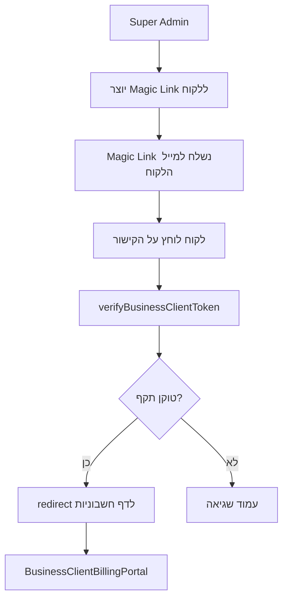

# 🏢 Business Client Portal - תיעוד מלא

> פורטל מאובטח ללקוחות עסקיים לצפייה בחשבוניות מ-Misrad-AI

---

## 🎯 מטרה

לאפשר ללקוחות עסקיים (Business Clients) לגשת לחשבוניות שלהם מ-Misrad-AI ללא צורך ביצירת חשבון משתמש מלא במערכת.

---

## 🔐 אבטחה - Magic Link Authentication

### Flow המלא:



### יצירת Magic Link

**מי יכול:** רק Super Admin

**איך:**
```typescript
// Admin Panel - ManageOrganizationClient.tsx (עתידי)
const handleSendMagicLink = async () => {
  const result = await generateBusinessClientMagicLink(businessClientId);
  
  if (result.success) {
    // שלח מייל עם result.data.magicLink
    await sendEmail({
      to: businessClient.email,
      subject: 'קישור גישה לפורטל חשבוניות - Misrad-AI',
      html: `
        <p>שלום ${businessClient.name},</p>
        <p>הנה קישור גישה מאובטח לפורטל החשבוניות שלך:</p>
        <a href="${result.data.magicLink}">כניסה לפורטל</a>
        <p>הקישור תקף ל-7 ימים.</p>
      `
    });
  }
};
```

### אימות טוקן

**פונקציה:** `verifyBusinessClientToken(token)`

**מה היא עושה:**
1. מחפשת את הטוקן ב-DB
2. בודקת שלא פג תוקף (`expires_at > NOW()`)
3. מחזירה: `businessClientId`, `businessClientName`, `organizationName`
4. מעדכנת `last_used_at`

**אבטחה:**
- טוקן אקראי 64 תווים (256 bits)
- תוקף: 7 ימים
- חד-פעמי למעשה (אפשר לעשות one-time use)
- מאוחסן מוצפן ב-DB

---

## 📁 מבנה קבצים

```
app/business-client/
├── layout.tsx                          # Layout עם gradient background
├── [token]/
│   ├── page.tsx                        # Auth page - מאמת טוקן
│   └── billing/
│       └── page.tsx                    # Billing portal page
└── expired/
    └── page.tsx                        # Error page - טוקן פג

app/actions/
├── business-client-auth.ts             # Magic link generation & verification
└── business-client-billing.ts          # Fetch invoices

components/business-client/
└── BusinessClientBillingPortal.tsx     # UI Component

prisma/migrations/
└── 20260308000001_add_business_client_tokens/
    └── migration.sql                   # Table creation
```

---

## 🗄️ Database Schema

### business_client_tokens

```sql
CREATE TABLE business_client_tokens (
  id UUID PRIMARY KEY,
  token VARCHAR(255) UNIQUE NOT NULL,
  business_client_id UUID REFERENCES business_clients(id),
  expires_at TIMESTAMPTZ NOT NULL,
  created_at TIMESTAMPTZ DEFAULT NOW(),
  last_used_at TIMESTAMPTZ
);
```

**Indexes:**
- `idx_business_client_tokens_token` (primary lookup)
- `idx_business_client_tokens_business_client_id`
- `idx_business_client_tokens_expires_at` (cleanup old tokens)

---

## 🎨 UI Components

### BusinessClientBillingPortal

**Props:**
```typescript
interface BusinessClientBillingPortalProps {
  businessClientId: string;
  businessClientName: string;
  organizationName: string;
  invoices: BusinessClientInvoice[];
  token: string;
}
```

**מה מוצג:**
1. **Header Card:**
   - שם הלקוח העסקי
   - שם הספק (ארגון)
   - אייקון Building

2. **Stats Cards (3):**
   - סה"כ חשבוניות
   - ממתין לתשלום
   - סה"כ שולם

3. **Pending Invoices Alert:**
   - רק אם יש חשבוניות ממתינות
   - רקע כתום
   - כפתור "שלם עכשיו" לכל חשבונית

4. **Invoice History:**
   - כל החשבוניות
   - ניתן להרחבה (Expandable)
   - כפתורים: תשלום, הורדת PDF, צפייה

---

## 🔄 תהליך מלא - End to End

### 1️⃣ **Super Admin יוצר קישור**

```typescript
// In Admin Panel
const result = await generateBusinessClientMagicLink(businessClientId);
// result.data.magicLink = "https://app.misrad-ai.com/business-client/abc123..."
```

### 2️⃣ **מייל נשלח ללקוח**

```html
<p>שלום חברת ABC,</p>
<p>הנה קישור לפורטל החשבוניות המאובטח שלך:</p>
<a href="https://app.misrad-ai.com/business-client/abc123def456...">
  כניסה לפורטל החשבוניות
</a>
<p>הקישור תקף ל-7 ימים מיום יצירתו.</p>
<p>בברכה,<br>צוות Misrad-AI</p>
```

### 3️⃣ **לקוח לוחץ על הקישור**

**URL:** `/business-client/abc123def456...`

**מה קורה:**
```typescript
// app/business-client/[token]/page.tsx
const result = await verifyBusinessClientToken(token);

if (!result.success) {
  // Show error page
  return <ErrorPage />;
}

// Redirect to billing
redirect(`/business-client/${token}/billing`);
```

### 4️⃣ **עמוד החשבוניות**

**URL:** `/business-client/abc123def456.../billing`

```typescript
// app/business-client/[token]/billing/page.tsx
const authResult = await verifyBusinessClientToken(token);
const invoicesResult = await getBusinessClientInvoices(businessClientId);

return <BusinessClientBillingPortal {...props} />;
```

---

## ⚙️ הגדרות

### Environment Variables

```bash
# .env.local
NEXT_PUBLIC_APP_URL=http://localhost:3000

# .env.prod_backup
NEXT_PUBLIC_APP_URL=https://app.misrad-ai.com
```

### Email Template (עתידי)

נמצא ב: `lib/email-templates/business-client-magic-link.ts`

```typescript
export function businessClientMagicLinkEmail(params: {
  businessClientName: string;
  organizationName: string;
  magicLink: string;
  expiresAt: Date;
}) {
  return {
    subject: `קישור גישה לפורטל חשבוניות - ${params.organizationName}`,
    html: `...`,
  };
}
```

---

## 🚀 Deployment

### 1️⃣ **Run Migration**

```bash
# DEV
npm run db:push:dev

# PROD (with approval)
dotenv -e .env.prod_backup -- npx prisma migrate deploy
```

### 2️⃣ **Verify Table Created**

```sql
SELECT table_name 
FROM information_schema.tables 
WHERE table_name = 'business_client_tokens';
```

### 3️⃣ **Test Magic Link Flow**

1. יצירת טוקן דרך Admin Panel
2. בדיקת URL בדפדפן
3. וידוא שהחשבוניות מוצגות

---

## 🛡️ Security Considerations

### ✅ **מה עשינו נכון:**

1. **Secure Random Token:**
   - 32 bytes = 256 bits
   - `crypto.randomBytes(32).toString('hex')`

2. **Expiration:**
   - 7 ימים בלבד
   - לא ניתן להאריך

3. **Last Used Tracking:**
   - מעקב אחרי שימוש
   - ניתן לזהות שימוש חשוד

4. **CASCADE Delete:**
   - מחיקת Business Client → מחיקת כל הטוקנים

5. **No Password:**
   - אין צורך בניהול סיסמאות
   - פחות סיכון

### ⚠️ **שיפורים אפשריים:**

1. **One-Time Use:**
   ```sql
   ALTER TABLE business_client_tokens 
   ADD COLUMN is_used BOOLEAN DEFAULT false;
   ```

2. **IP Whitelist:**
   ```sql
   ALTER TABLE business_client_tokens 
   ADD COLUMN allowed_ips TEXT[];
   ```

3. **Audit Log:**
   ```sql
   CREATE TABLE business_client_access_logs (
     id UUID PRIMARY KEY,
     token_id UUID REFERENCES business_client_tokens(id),
     accessed_at TIMESTAMPTZ,
     ip_address VARCHAR,
     user_agent TEXT
   );
   ```

---

## 📊 Analytics & Monitoring

### מדדים לבדוק:

1. **Token Usage:**
   - כמה טוקנים נוצרו?
   - כמה בפועל נוצרו בשימוש?
   - כמה פגו מבלי שימוש?

2. **Access Patterns:**
   - מתי לקוחות ניגשים לפורטל?
   - כמה זמן הם מבלים?
   - אילו חשבוניות הם פותחים?

3. **Conversion:**
   - כמה חשבוניות שולמו דרך הפורטל?
   - מה זמן התגובה הממוצע?

---

## 🔧 Future Enhancements

### שלב 2 (עתידי):

1. **Self-Service Magic Link:**
   - לקוח יכול לבקש קישור חדש בעצמו
   - דרך דף "שכחת סיסמה" או דומה

2. **Download All Invoices:**
   - ZIP file עם כל החשבוניות בPDF

3. **Payment History Graph:**
   - גרף ויזואלי של תשלומים לאורך זמן

4. **Automatic Reminders:**
   - תזכורת אוטומטית לחשבוניות שלא שולמו

5. **Multi-Language:**
   - תמיכה באנגלית בנוסף לעברית

---

## ✅ Checklist לפני Production

- [ ] Migration רצה בהצלחה
- [ ] טבלה נוצרה עם כל האינדקסים
- [ ] Email template מוכן
- [ ] Environment variables מוגדרים
- [ ] בדיקת E2E flow שלמה
- [ ] Monitoring הוקם
- [ ] Docs עודכנו
- [ ] Super Admin יודע איך ליצור קישורים

---

## 📞 Support

**שאלות טכניות:** dev@misrad-ai.com  
**שאלות חיוב:** billing@misrad-ai.com

---

**Created:** March 2026  
**Last Updated:** March 8, 2026  
**Version:** 1.0.0
