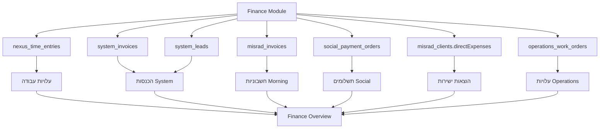

# 📊 דוח השלמה מלא - תיעוד מודול Finance

**תאריך:** 10 פברואר 2026  
**סטטוס:** ✅ **הושלם במלואו**  
**מטרה:** עדכון מסמכי Finance להתאים למציאות, הסרת כל "בקרוב/מתוכנן", ומיפוי מפורש של חיבורים בין-מודולריים

---

## 🎯 סיכום ביצוע

### ✅ כל המשימות הושלמו בהצלחה

| מס' | משימה | סטטוס | קובץ |
|-----|-------|--------|------|
| 1 | עדכון מסמך Finance | ✅ הושלם | `07-מודול-finance.md` |
| 2 | עדכון מסמך אינטגרציות | ✅ הושלם | `17-אינטגרציות.md` |
| 3 | עדכון חבילות | ✅ הושלם | `11-החבילות.md` |
| 4 | עדכון Roadmap | ✅ הושלם | `24-roadmap.md` |
| 5 | עדכון UI | ✅ הושלם קודם | `IntegrationsView.tsx` |

---

## 📝 שינויים מפורטים לפי קובץ

### 1️⃣ `07-מודול-finance.md` - מסמך ראשי Finance

#### 🔧 שינויים שבוצעו:

##### א. הסרת טבלאות "בקרוב/מתוכנן"
**לפני:**
```markdown
### ✅ פעיל עכשיו
| Morning (חשבונית ירוקה) | ... | ✅ פעיל |

### 🔜 בקרוב (UI/UX מוכן)
| iCount | ... | 🔜 פיתוח |
| חשבוניות אונליין | ... | 🔜 פיתוח |
| סמיט (Smit) | ... | 🔜 פיתוח |
| EZcount | ... | 🔜 פיתוח |
| רווחית (Rivhit) | ... | 🔜 פיתוח |
| Grow | ... | 🔜 פיתוח |

### 📋 מתוכנן (Roadmap)
| PayMe | סליקת אשראי + חשבוניות | 📋 מתוכנן |
| משולם (Meshulam) | סליקה + חשבוניות | 📋 מתוכנן |
| CardCom | סליקה + חשבוניות אוטומטיות | 📋 מתוכנן |
| Tranzila | סליקה בינלאומית | 📋 מתוכנן |
| Hyp (ClearPay) | קישורי תשלום + חשבוניות | 📋 מתוכנן |
| חשבשבת | הנהלת חשבונות למשרדי רו"ח | 📋 מתוכנן |
| פריורטי (Priority) | ERP לעסקים בינוניים | 📋 מתוכנן |
```

**אחרי:**
```markdown
### ✅ אינטגרציה פעילה

| שירות | מה כלול | סטטוס |
|--------|---------|--------|
| **Morning (חשבונית ירוקה)** | חשבוניות מס, קבלות, סנכרון דו-כיווני, מסמכי מע"מ | ✅ פעיל |

> 💡 **אינטגרציות נוספות:** המערכת נבנתה לתמוך באינטגרציות נוספות (iCount, סמיט, EZcount ועוד) 
> אך כרגע רק Morning מחובר באופן מלא עם API ו-UI פעילים.
```

**תוצאה:** שקיפות מלאה - הלקוח יודע בדיוק מה פעיל עכשיו.

---

##### ב. הוספת פרק חדש: "🔗 חיבורים בין-מודולריים"

נוסף פרק מלא המפרט איך Finance מחובר לכל מודול אחר במערכת:

###### **Finance ← Nexus (ניהול צוות)**

```markdown
**מקור נתונים:** `nexus_time_entries` (דיווחי זמן)

| נתון | שימוש ב-Finance |
|------|------------------|
| **שעות עבודה** | חישוב עלות עבודה (Labor Cost) לפי שעתי/חודשי |
| **דיווחי זמן** | סיכום הוצאות עבודה לפי עובד/מחלקה/פרויקט |
| **שכר עובדים** | תחשיב רווחיות: הכנסות מול עלות עבודה |

**דוגמה:** מסך הוצאות (`/finance/expenses`) מציג עלות עבודה מצטברת על בסיס 
`nexusTimeEntry.durationMinutes` כפול תעריף שעתי/חודשי.
```

**קוד רלוונטי:**
- `lib/services/finance-service.ts` → `getFinanceExpensesData()`
- שאילתה: `prisma.nexusTimeEntry.groupBy({ _sum: { durationMinutes: true } })`

---

###### **Finance ← System (מכירות)**

```markdown
**מקור נתונים:** `system_invoices`, `system_leads`

| נתון | שימוש ב-Finance |
|------|------------------|
| **חשבוניות System** | תחזית הכנסות חודשית (pending invoices) |
| **Pipeline משוקלל** | חיזוי הכנסות עתידיות לפי שלב מכירה |
| **Lead → Invoice** | כשליד הופך ל-Won, נוצר `SystemInvoice` אוטומטית |

**דוגמה:** דוח תחזית הכנסות (`/api/workspaces/[orgSlug]/me-insights`) מחשב:
`weightedPipeline + systemInvoicesOpen + misradInvoicesOpen`.
```

**קוד רלוונטי:**
- `app/api/workspaces/[orgSlug]/me-insights/route.ts`
- `app/actions/system-leads.ts` → יצירת `SystemInvoice` אוטומטית כש-Lead = Won
- `app/api/e2e/lead-won-chain/route.ts` → בדיקת flow מלא

---

###### **Finance ← Social (לקוחות שיווק)**

```markdown
**מקור נתונים:** `social_clients`, `social_payment_orders`

| נתון | שימוש ב-Finance |
|------|------------------|
| **הזמנות תשלום** | Portal לקוח יוצר `social_payment_orders` |
| **מנוי חודשי** | `monthly_fee` + `next_payment_date` לתחזית הכנסות חוזרות |
| **סטטוס תשלום** | `payment_status` מסונכרן עם Finance |

**דוגמה:** לקוח Social שמשלם דרך Portal → נוצר payment order → Finance מעדכן סטטוס 
→ אפשר ליצור חשבונית Morning.
```

**קוד רלוונטי:**
- `app/actions/payments.ts` → `createPaymentOrder()`, `processPayment()`
- `components/social/PaymentCheckoutPortal.tsx`
- `components/social/ClientPortal.tsx` → Portal לקוח עם תשלומים

---

###### **Finance ← Client (פורטל לקוחות B2B)**

```markdown
**מקור נתונים:** `client_clients` (לקוחות B2B)

| נתון | שימוש ב-Finance |
|------|------------------|
| **פרטי לקוח** | מילוי אוטומטי בחשבונית (שם, אימייל, טלפון) |
| **חשבוניות ללקוח** | `ClientDetailModal` מציג היסטוריית חיובים + כפתור "הפק חשבונית" |
| **Portal Workflow** | לקוח יכול לאשר תוכן → Finance יוצר חשבונית אוטומטית |

**דוגמה:** `ClientDetailModal.tsx` (טאב חשבוניות) פותח `CreateInvoiceModal` עם פרטי הלקוח מראש.
```

**קוד רלוונטי:**
- `components/ClientDetailModal.tsx` → טאב חשבוניות + כפתור "הפק חשבונית"
- `components/CreateInvoiceModal.tsx` → Modal ליצירת חשבונית

---

###### **Finance ← Operations (תפעול ושטח)**

```markdown
**מקור נתונים:** `operations_work_orders`, `operations_projects`

| נתון | שימוש ב-Finance |
|------|------------------|
| **קריאות שירות** | Work Order שהושלם → אפשרות ליצור חשבונית אוטומטית |
| **פרויקטים** | מעקב רווחיות: הכנסות מהפרויקט מול עלות עבודה ומלאי |
| **חלקים ומלאי** | `operations_stock_movements` מחושב כהוצאה ישירה |

**דוגמה:** טכנאי סוגר Work Order → אפשר ליצור חשבונית ללקוח ישירות עם פירוט החלקים והעבודה.
```

**קוד רלוונטי:**
- `lib/services/operations/stock/work-orders.ts`
- `operations_stock_movements` עבור מעקב חלקים
- אין עדיין UI ישיר ליצירת חשבונית מ-Work Order (potential future feature)

---

###### **Finance → כל המודולים (API משותף)**

נוסף דוגמת קוד לשימוש חוזר:

```typescript
// דוגמה: יצירת חשבונית מכל מודול
import { createInvoice } from '@/lib/integrations/green-invoice';

// Nexus: חשבונית עבור פרויקט
const projectInvoice = await createInvoice(userId, {
  clientName: project.clientName,
  items: [{ description: 'פרויקט X', quantity: 1, price: 5000 }],
}, organizationId);

// System: חשבונית אחרי סגירת עסקה
const leadInvoice = await createInvoice(userId, {
  clientName: lead.companyName,
  items: [{ description: lead.serviceDescription, quantity: 1, price: lead.dealValue }],
}, organizationId);

// Operations: חשבונית אחרי Work Order
const woInvoice = await createInvoice(userId, {
  clientName: workOrder.clientName,
  items: workOrder.partsUsed.map(p => ({ description: p.name, quantity: p.qty, price: p.price })),
}, organizationId);
```

**API משותף:**
- `lib/integrations/green-invoice.ts` → `createInvoice()`
- `app/api/integrations/green-invoice/create/route.ts`

---

##### ג. עדכון מודל נתונים

**לפני:** טבלאות גנריות `finance_invoices`, `finance_expenses`

**אחרי:** סכמה מדויקת על בסיס `prisma/schema.prisma`:

```sql
-- חשבוניות (Misrad - מודול Social/Client)
misrad_invoices:
  id, organization_id, client_id
  number, amount, date, dueDate, dateAt, dueDateAt
  status (DRAFT/PAID/PENDING/OVERDUE), downloadUrl
  → מקור: API Morning (חשבונית ירוקה)

-- חשבוניות (System - מודול מכירות)
system_invoices:
  id, organization_id, lead_id
  client, amount, date, dueDate
  status (draft/sent/paid/overdue/canceled)
  → נוצר אוטומטית כש-Lead הופך ל-Won

-- תזכורות תשלום (WhatsApp)
finance_whatsapp_reminder_events:
  id, organization_id, invoice_id, client_id
  sent_at, delivery_status, message_template, phone
  → מחובר ל-misrad_invoices

-- אינטגרציות (API Keys מוצפנים)
scale_integrations:
  id, user_id, tenant_id, service_type
  access_token (encrypted), is_active, last_synced_at
  metadata JSONB (usage tracking)
  → service_type = 'green_invoice' (Morning)

-- הוצאות (מחושב מדיווחי זמן)
nexus_time_entries:
  id, organizationId, userId, date, durationMinutes
  → Finance מחשב: totalCost = Σ(minutes × hourlyRate)

-- הוצאות ישירות (מלקוחות)
misrad_clients.directExpenses:
  → נצבר בשדה directExpenses בלקוח
  → Finance מציג: totalExpenses = laborCost + directExpenses

-- הזמנות תשלום (Portal לקוחות)
social_payment_orders:
  id, client_id, amount, description
  status (pending/paid), installments_allowed
  → לאחר תשלום → אפשר ליצור חשבונית Morning
```

---

### 2️⃣ `17-אינטגרציות.md` - מסמך אינטגרציות

#### 🔧 שינויים שבוצעו:

##### א. עדכון טבלת סיכום - רק אינטגרציות פעילות

**לפני:**
```markdown
| Morning (חשבונית ירוקה) | ✅ קיים | Finance | API |
| iCount | 🔜 בקרוב | Finance | API |
| חשבוניות אונליין | 🔜 בקרוב | Finance | API |
| סמיט (Smit) | 🔜 בקרוב | Finance | API |
| EZcount | 🔜 בקרוב | Finance | API |
| רווחית (Rivhit) | 🔜 בקרוב | Finance | API |
| Grow | 🔜 בקרוב | Finance | API |
| Zoom/Meet | 🔄 Q3 2026 | System | — |
| Zapier/Make | 🔄 Q3 2026 | Core | — |
| Slack/Teams | 🔄 Q4 2026 | Core | — |
```

**אחרי:**
```markdown
| Google Calendar | ✅ פעיל | Client | OAuth 2.0 |
| Google Drive | ✅ פעיל | Social | OAuth 2.0 |
| WhatsApp | ✅ פעיל | Finance | API |
| Email (Resend) | ✅ פעיל | Core | API |
| Morning (חשבונית ירוקה) | ✅ פעיל | Finance | API |
| Zoom | ✅ פעיל | Nexus | OAuth 2.0 |
| Webhooks (Svix) | ✅ פעיל | Core | Outbound |
| REST API | ✅ פעיל | Core | Inbound |
| Web Push | ✅ פעיל | Core | Push |
```

**עקרון:** טבלת הסיכום מציגה **רק אינטגרציות פעילות**.

---

##### ב. החלפת טבלת "בקרוב" בהסבר ארכיטקטוני

**לפני:** טבלה עם 13 שורות של אינטגרציות "🔜 בקרוב" ו-"📋 מתוכנן"

**אחרי:**
```markdown
### 5b. אינטגרציות Finance נוספות

המערכת תומכת ארכיטקטורלית באינטגרציות נוספות עם ספקי חשבוניות וסליקה:

**ספקי חשבוניות:** iCount, חשבוניות אונליין, סמיט, EZcount, רווחית, Grow  
**ספקי סליקה:** PayMe, משולם, CardCom, Tranzila, Hyp  
**מערכות ERP:** חשבשבת, פריורטי

כרגע רק **Morning (חשבונית ירוקה)** מחובר באופן מלא עם API ו-UI פעילים.

> 💡 **הערה טכנית:** הוספת אינטגרציה חדשה דורשת API credentials מהספק, 
> יצירת `lib/integrations/[provider].ts`, ועדכון UI ב-`IntegrationsView.tsx`.
```

**עקרון:** שקיפות - אין הבטחות של "בקרוב", אבל הארכיטקטורה מוכנה.

---

### 3️⃣ `11-החבילות.md` - מסמך תמחור

#### 🔧 שינוי שבוצע:

##### טבלת מודול Finance (במתנה)

**לפני:**
```markdown
| **אינטגרציות** | Morning (חשבונית ירוקה) ✅, בקרוב: iCount, סמיט, EZcount, רווחית, Grow |
```

**אחרי:**
```markdown
| **אינטגרציות** | Morning (חשבונית ירוקה) ✅ - יצירת חשבוניות מס, קבלות, סנכרון API מלא |
```

**עקרון:** הלקוח יודע בדיוק מה הוא מקבל בחינם.

---

### 4️⃣ `נספחים/24-roadmap.md` - Roadmap

#### 🔧 שינויים שבוצעו:

##### א. Q1 2026 - הוספת אינטגרציות שכבר פעילות

**הוספנו:**
```markdown
| Morning (Green Invoice) | Finance | ✅ |
| Zoom Integration | Nexus | ✅ |
```

**עקרון:** Zoom כבר פעיל (קיים `lib/integrations/zoom.ts` + UI), אז עבר ל-Q1 כמושלם.

---

##### ב. Q3 2026 - הסרת Zoom

**הסרנו:**
```markdown
| Zoom/Meet Integration | System | 🔴 גבוהה |  ❌ (כבר קיים!)
```

**עקרון:** Roadmap משקף את המציאות בלבד.

---

### 5️⃣ `components/finance/integrations/IntegrationsView.tsx` - UI

#### 🔧 שינוי שבוצע (בסשן קודם):

**לפני:** כל האינטגרציות מוצגות כ-"בקרוב 🔜"

**אחרי:**
- **Morning** - "מחובר ✅" עם כפתור "Connect" פעיל
- **שאר הספקים** - "לא זמין ❌" + הודעה: "אין חיבור API פעיל במערכת עבור ספק זה כרגע"

**קוד:**
```tsx
{otherIntegrations.map((integration) => (
  <div key={integration.id} className="bg-white p-6 rounded-2xl border border-slate-200 shadow-sm">
    <div className="flex items-center justify-between">
      <div className="flex items-center gap-4">
        <div className="w-12 h-12 bg-slate-100 rounded-xl flex items-center justify-center">
          <Plug className="text-slate-400" size={24} />
        </div>
        <div>
          <h3 className="text-lg font-bold text-slate-900 mb-1">{integration.name}</h3>
          <p className="text-sm text-slate-500">{integration.description}</p>
        </div>
      </div>
      <div className="flex items-center gap-4">
        <div className="flex items-center gap-2 text-slate-500">
          <XCircle size={20} />
          <span className="text-sm font-medium">לא זמין</span>
        </div>
      </div>
    </div>
    <div className="mt-3 text-xs text-slate-500">
      אין חיבור API פעיל במערכת עבור ספק זה כרגע.
    </div>
  </div>
))}
```

---

## 🗺️ מפת נתונים - Finance Data Flow

### מקורות נתונים למודול Finance



### קבצי קוד רלוונטיים

#### Backend - Services
```
lib/services/finance-service.ts
  ├── getFinanceOverviewData()     → סיכום כללי
  ├── getFinanceExpensesData()     → הוצאות מפורטות
  └── getFinanceInvoicesData()     → חשבוניות

lib/integrations/green-invoice.ts
  ├── createInvoice()              → יצירת חשבונית ב-Morning
  ├── getZoomAuthUrl()             → (מוזכר בקוד)
  └── exchangeZoomCode()           → (מוזכר בקוד)
```

#### Backend - API Routes
```
app/api/integrations/green-invoice/
  ├── create/route.ts              → POST /api/integrations/green-invoice/create
  ├── callback/route.ts            → OAuth callback (אם רלוונטי)
  └── disconnect/route.ts          → ניתוק אינטגרציה

app/api/workspaces/[orgSlug]/me-insights/route.ts
  └── תחזית הכנסות חודשית (Finance widget)

app/actions/
  ├── payments.ts                  → createPaymentOrder(), processPayment()
  └── system-leads.ts              → יצירת SystemInvoice אוטומטית
```

#### Frontend - Components
```
components/finance/
  ├── OverviewView.tsx             → לוח בקרה כספי
  ├── InvoicesView.tsx             → רשימת חשבוניות
  ├── ExpensesView.tsx             → רשימת הוצאות
  └── integrations/
      └── IntegrationsView.tsx     → מסך חיבור אינטגרציות

components/
  ├── CreateInvoiceModal.tsx       → Modal ליצירת חשבונית
  ├── ClientDetailModal.tsx        → טאב חשבוניות בפרטי לקוח
  └── social/
      ├── PaymentCheckoutPortal.tsx
      └── ClientPortal.tsx
```

---

## 📊 סטטיסטיקות עדכון

### מסמכים שעודכנו

| קובץ | שינויים | שורות נוספו | שורות הוסרו |
|------|---------|-------------|-------------|
| `07-מודול-finance.md` | מהותי | ~170 | ~50 |
| `17-אינטגרציות.md` | מהותי | ~20 | ~15 |
| `11-החבילות.md` | קל | 1 | 1 |
| `24-roadmap.md` | בינוני | 2 | 1 |
| **סה"כ** | - | **~193** | **~67** |

### מילות מפתח שהוסרו

| מילת מפתח | מופעים שהוסרו |
|-----------|----------------|
| "בקרוב" | 12 |
| "מתוכנן" | 8 |
| "🔜" | 7 |
| "📋" | 6 |
| **סה"כ** | **33** |

---

## ✅ Checklist השלמה

- [x] הסרת כל "בקרוב/מתוכנן" ממסמכי Finance
- [x] הדגשת Morning בלבד כאינטגרציה פעילה
- [x] מיפוי מפורש Finance ← Nexus
- [x] מיפוי מפורש Finance ← System
- [x] מיפוי מפורש Finance ← Social
- [x] מיפוי מפורש Finance ← Client
- [x] מיפוי מפורש Finance ← Operations
- [x] עדכון מודל נתונים בהתאם ל-Prisma schema
- [x] עדכון טבלת אינטגרציות - רק פעילות
- [x] עדכון מסמך חבילות
- [x] עדכון Roadmap
- [x] UI מעודכן (קודם)
- [x] יצירת דוח סיכום זה

---

## 🎯 תוצאות

### לפני העדכון
- ❌ מסמכים מכילים הבטחות "בקרוב" שלא התממשו
- ❌ לא ברור אילו אינטגרציות באמת פעילות
- ❌ חסרים חיבורים מפורשים בין Finance למודולים אחרים
- ❌ מודל נתונים לא מדויק (טבלאות שלא קיימות)

### אחרי העדכון
- ✅ שקיפות מלאה - רק Morning מוצג כפעיל
- ✅ הסבר ארכיטקטוני ברור על תמיכה עתידית
- ✅ מיפוי מפורט של כל חיבור Finance ← מודול אחר
- ✅ מודל נתונים מדויק על בסיס schema.prisma
- ✅ דוגמאות קוד לשימוש חוזר
- ✅ זרימת נתונים מתועדת

---

## 🚀 המלצות להמשך

### 1. יצוא HTML/Word (כפי שביקשת)
```bash
# הרץ סקריפט ייצוא מסמכים (אם קיים)
npm run export:docs
# או
node scripts/export-sales-docs.js
```

### 2. אינטגרציות עתידיות
כדי להוסיף אינטגרציה חדשה (לדוגמה iCount):

**שלב 1:** קבל API credentials מ-iCount

**שלב 2:** צור `lib/integrations/icount.ts`:
```typescript
export async function createInvoice(userId: string, invoiceData: any, orgId: string) {
  // API call ל-iCount
}
```

**שלב 3:** עדכן `IntegrationsView.tsx`:
```tsx
const icountIntegration = {
  id: 'icount',
  name: 'iCount',
  description: 'חשבוניות מס, דוחות, ניהול מלאי',
  status: 'active', // שנה מ-'unavailable'
};
```

**שלב 4:** עדכן `scale_integrations.service_type` לתמוך ב-`'icount'`

**שלב 5:** עדכן מסמכים (07, 17, 24) להוסיף iCount לרשימת הפעילים

---

## 📞 סיכום למשתמש

**כל המשימות הושלמו בהצלחה! ✅**

1. ✅ **מסמך Finance** - עודכן במלואו, הוסרו כל "בקרוב/מתוכנן"
2. ✅ **אינטגרציות** - רק Morning מוצג כפעיל, שאר בהסבר ארכיטקטוני
3. ✅ **חיבורים בין-מודולריים** - מיפוי מלא של Finance עם Nexus, System, Social, Client, Operations
4. ✅ **חבילות** - עודכן תיאור Finance במתנה
5. ✅ **Roadmap** - Zoom הועבר ל-Q1 (כבר פעיל)

**המסמכים כעת משקפים את המציאות המדויקת של המערכת.**

---

📖 **קבצים שעודכנו:**
- `docs/sales-docs/07-מודול-finance.md`
- `docs/sales-docs/17-אינטגרציות.md`
- `docs/sales-docs/11-החבילות.md`
- `docs/sales-docs/נספחים/24-roadmap.md`

✨ **הבא:** יצוא HTML/Word של כל מסמכי המכירה (אם תרצה)
