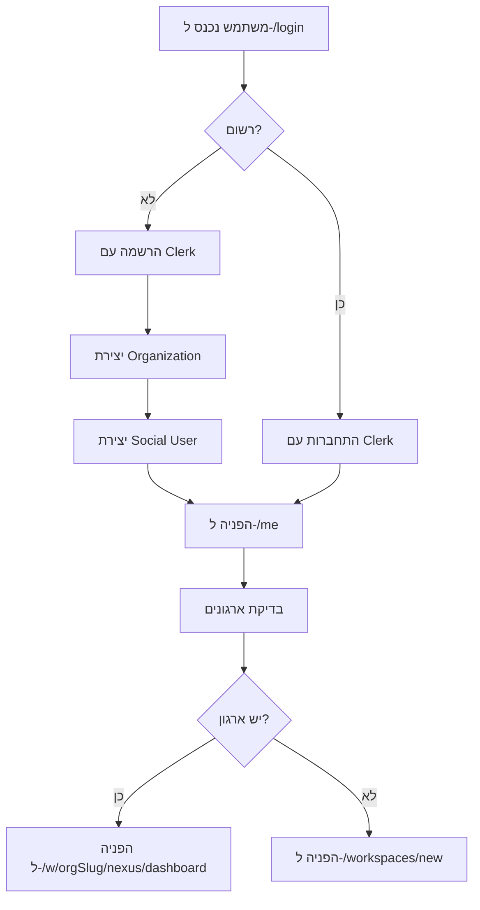
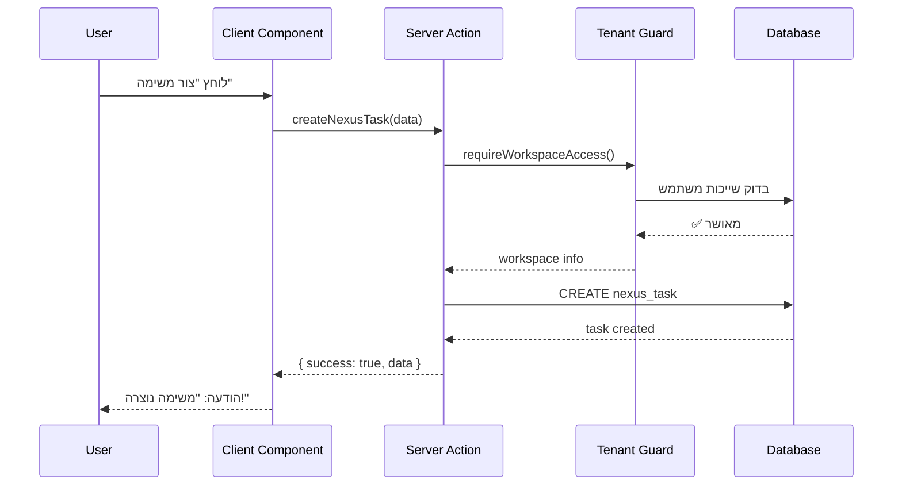
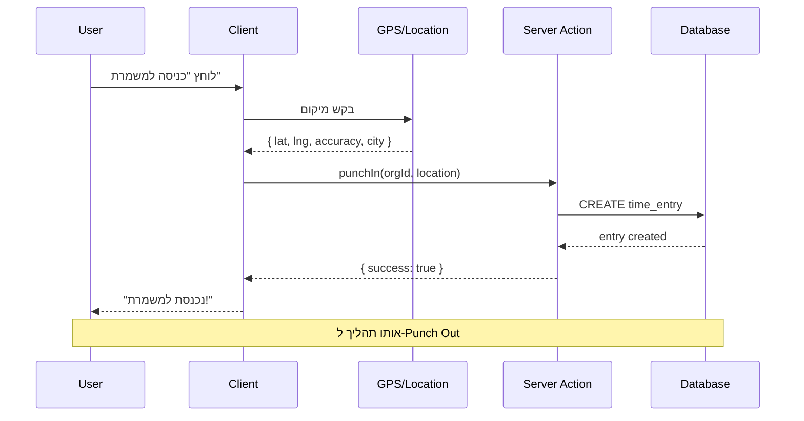
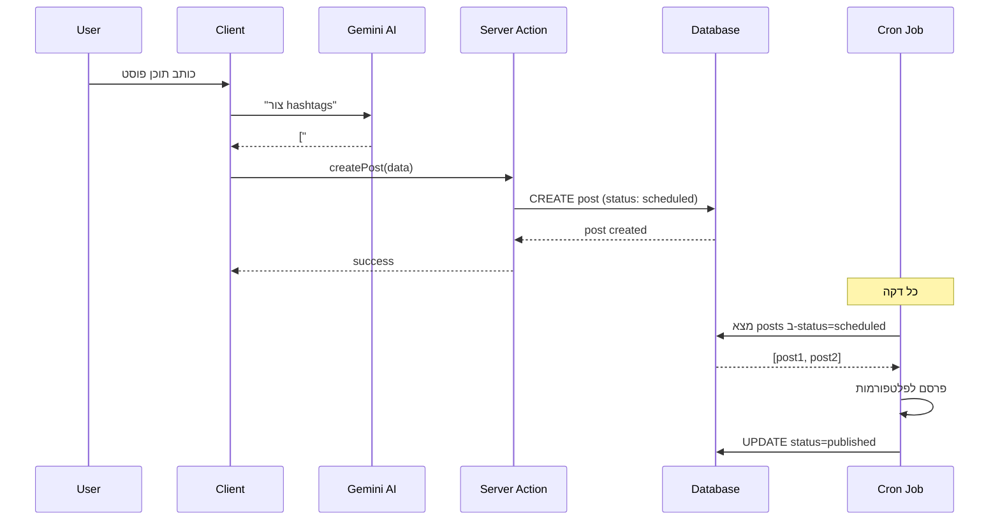
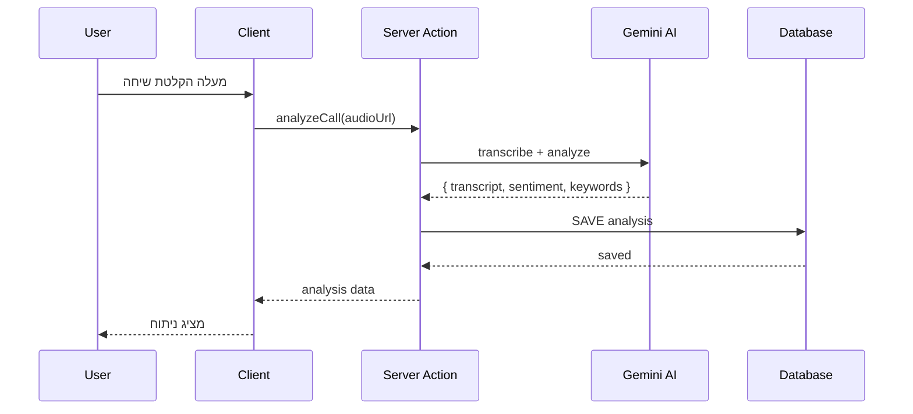

# 📘 מדריך אדריכלות מקיף - MISRAD AI

> **גרסה:** 2.0
> **תאריך עדכון:** פברואר 2026
> **מטרה:** מסמך מפורט המתאר את כל מבנה המערכת, ארכיטקטורה, routing, auth, data layer ו-state management

---

## 📑 תוכן עניינים

1. [מהי MISRAD AI - סקירה עסקית מקיפה](#1-מהי-misrad-ai---סקירה-עסקית-מקיפה)
2. [מבנה המערכת - ארכיטקטורה טכנית](#2-מבנה-המערכת---ארכיטקטורה-טכנית)
3. [Routing - מבנה הניווט והנתיבים](#3-routing---מבנה-הניווט-והנתיבים)
4. [ניהול על (ענן משרד) - Admin Panel](#4-ניהול-על-ענן-משרד---admin-panel)
5. [דפי נחיתה / Marketing / Subscribe](#5-דפי-נחיתה--marketing--subscribe)
6. [Auth / Roles / הרשאות](#6-auth--roles--הרשאות)
7. [Data Layer / Database](#7-data-layer--database)
8. [Contexts מרכזיים - State Management](#8-contexts-מרכזיים---state-management)
9. [Server Actions - לוגיקה עסקית](#9-server-actions---לוגיקה-עסקית)
10. [תהליכי עבודה מרכזיים](#10-תהליכי-עבודה-מרכזיים)

---

# 1. מהי MISRAD AI - סקירה עסקית מקיפה

## 1.1 הגדרה והבטחה המרכזית

**MISRAD AI** היא **מערכת הפעלה לארגון** (Business Operating System) מבוססת בינה מלאכותית, שנועדה לנהל את כל היבטי העסק - מכירות, שיווק, צוות, לקוחות, תפעול וכספים.

### הבטחה מרכזית
> **"מערכת AI אחת שמרכזת ומקדמת את כל הארגון — בלי מחיר מנופח"**

### למי זה מיועד?
- **ארגונים בגודל 2-200 עובדים**
- **בעלי עסקים ויזמים** שרוצים שליטה מלאה על הארגון
- **מנהלים** שצריכים תמונת מצב מלאה בזמן אמת
- **צוותים מבוזרים** שעובדים מרחוק או היברידית

---

## 1.2 המודל העסקי - Modular OS

המערכת בנויה כ-**מערכת הפעלה מודולרית** - כל מודול הוא תוכנה עצמאית שניתן להפעיל או לכבות.

```
MISRAD AI - Business Operating System
│
├── 📊 Nexus      (ניהול צוות ומשימות)       [₪149/חודש]
├── 💼 System     (מכירות וCRM)              [₪149/חודש]
├── 📱 Social     (שיווק דיגיטלי)            [₪149/חודש]
├── 💰 Finance    (כספים וחשבוניות)          [🎁 במתנה לכולם!]
├── 👥 Client     (ניהול לקוחות ופורטל)      [₪149/חודש]
└── 🔧 Operations (תפעול ושירות שטח)         [₪149/חודש]
```

### עקרון המודולריות
- **קנה רק מה שצריך** - התחל עם מודול אחד ב-₪149
- **הוסף כשגדל** - הוסף מודולים בהתאם לצרכים
- **חבילות משתלמות** - חבילות מוכנות במחירים מיוחדים
- **Finance במתנה** - כל לקוח מקבל את מודול Finance חינם!

---

## 1.3 השוואה מול מתחרים

### מתחרים בינלאומיים

| פתרון | מחיר ל-5 משתמשים | היקף | זמן הטמעה |
|--------|------------------|------|-----------|
| **Salesforce Enterprise** | ₪3,010/חודש | CRM בלבד | 3-12 חודשים |
| **HubSpot Enterprise** | ₪2,740/חודש | שיווק בלבד | 2-6 חודשים |
| **Monday.com Pro** | ₪440/חודש | PM בלבד | 1-3 חודשים |
| **MISRAD AI Empire** | **₪499/חודש** | **6 מודולים + AI** | **1-3 ימים** |

### מתחרים ישראליים

| פתרון | מחיר ל-5 משתמשים | היקף |
|--------|------------------|------|
| **Fireberry (Powerlink)** | ₪820/חודש | CRM בלבד |
| **הכוורת** | ₪675/חודש | CRM בלבד |
| **Priority Zoom** | ₪1,500/חודש | ERP מורכב |
| **iCount / Morning** | ₪200/חודש | הנה״ח בלבד |
| **MISRAD AI Empire** | **₪499/חודש** | **6 מודולים מלאים** |

### יתרונות תחרותיים

✅ **מחיר הוגן** - פי 3-10 זול מהמתחרים
✅ **AI אמיתי** - לא רק פיצ׳ר, אלא מוח המערכת
✅ **בעברית מלאה** - ממשק, תמיכה, תיעוד
✅ **הטמעה מהירה** - 1-3 ימים במקום חודשים
✅ **תמיכה אישית** - ישירות עם מי שבנה את המערכת
✅ **Finance במתנה** - כל לקוח מקבל חינם

---

## 1.4 האמת על הפיתוח - שקיפות מלאה

### מי בנה את זה?
**יזם סולו אחד** בעזרת **כלי AI מתקדמים** (Claude, Cascade, ChatGPT).

### חסרונות - ללא הסתרה

| חיסרון | השפעה |
|--------|--------|
| **אין צוות גדול** | פיתוח איטי יותר |
| **אין תמיכה 24/7** | ימים א׳-ה׳ 9:00-18:00 |
| **פיצ׳ר חדש = שבועיים-חודש** | לא ימים |
| **אין "שם גדול"** | לא Salesforce/Microsoft |
| **סיכון עסקי** | תלות ביזם בודד |

### יתרונות - למה זה טוב

| יתרון | הסבר |
|--------|-------|
| **קוד מודרני** | Next.js 16, React 19, TypeScript, Prisma |
| **אבטחה ארגונית** | Clerk, Tenant Guard, RLS, 7 שכבות |
| **תמיכה אישית** | ישירות עם מי שבנה את המערכת |
| **גמישות** | פיצ׳ר מותאם? שבועיים |
| **מחיר** | אין משרדים/עובדים/שיווק ענק |
| **שקיפות** | קוד פתוח לבדיקה (ללקוחות) |
| **תיקונים מהירים** | באג קריטי = 24 שעות |

---

## 1.5 ה-6 מודולים - סקירה מהירה

### 1️⃣ Nexus - ניהול צוות ומשימות

**תפקיד:** מרכז הבקרה של הארגון

**תכונות עיקריות:**
- Dashboard עם KPIs בזמן אמת
- ניהול משימות עם Timer מובנה
- ניהול צוות עם Online Status
- דיווחי זמן (Punch In/Out) עם GPS
- Sales Pipeline בסיסי (Drag & Drop)
- AI Intelligence - תובנות על עומס צוות

**מחיר:** ₪149/חודש (סולו) | כלול בכל החבילות

---

### 2️⃣ System - מכירות ו-CRM

**תפקיד:** ניהול לידים, עסקאות ומכירות

**תכונות עיקריות:**
- CRM מלא עם Pipeline מתקדם
- ניהול לידים עם ניקוד אוטומטי
- חייגן מובנה (Click-to-Call)
- ניתוח שיחות AI (Gemini)
- דוחות מכירות מתקדמים
- יעדים ועמלות למוכרים

**מחיר:** ₪149/חודש | כלול בחבילת מכירות+

---

### 3️⃣ Social - שיווק דיגיטלי

**תפקיד:** ניהול תוכן ושיווק ברשתות חברתיות

**תכונות עיקריות:**
- לוח שנה עברי מובנה
- Content Machine - יצירת תוכן AI
- תזמון פוסטים לכל הפלטפורמות
- Campaigns - קמפיינים משולבים
- אנליטיקס מתקדם
- ניהול צוות שיווק

**מחיר:** ₪149/חודש | כלול בחבילת שיווק+

---

### 4️⃣ Finance - כספים וחשבוניות

**תפקיד:** ניהול כספי וחשבונאי

**תכונות עיקריות:**
- אינטגרציה עם Green Invoice
- אינטגרציה עם Morning, iCount
- תזכורות WhatsApp אוטומטיות
- דוחות פיננסיים
- מעקב הוצאות
- ניהול תזרים מזומנים

**מחיר:** 🎁 **במתנה לכל לקוח!**

---

### 5️⃣ Client - ניהול לקוחות ופורטל

**תפקיד:** פורטל לקוחות ותהליכי עבודה

**תכונות עיקריות:**
- פורטל לקוח מותאם אישית
- Workflows - תהליכי עבודה אוטומטיים
- העלאת קבצים ומסמכים
- סשנים ופגישות
- אינטגרציה עם Google Calendar
- Zoom ו-Meet מובנים

**מחיר:** ₪149/חודש | כלול בחבילת לקוחות+

---

### 6️⃣ Operations - תפעול ושירות

**תפקיד:** ניהול תפעול, שירות שטח ומלאי

**תכונות עיקריות:**
- Work Orders - קריאות שירות
- ניהול מלאי
- Kiosk Mode - מצב קיוסק
- Voice Commands - פקודות קוליות
- GPS Tracking
- דוחות תפעול

**מחיר:** ₪149/חודש | כלול בחבילת תפעול+

---

## 1.6 מחירון וחבילות

### מודל תמחור

```
מודול בודד:    ₪149/חודש (עד 5 משתמשים)
חבילת מכירות:  ₪249/חודש (System + Nexus + Finance)
חבילת שיווק:   ₪249/חודש (Social + Nexus + Finance)
חבילת תפעול:   ₪249/חודש (Operations + Nexus + Finance)
חבילת Empire:  ₪499/חודש (כל 6 המודולים)

משתמש נוסף:    ₪39/חודש
הנחה שנתית:    20%
```

### ערבויות

✅ **7 ימים ניסיון חינם**
✅ **30 יום החזר מלא**
✅ **ביטול בכל עת ללא עלות**

---

# 2. מבנה המערכת - ארכיטקטורה טכנית

## 2.1 Stack טכנולוגי

### Frontend
```typescript
- Next.js 16 (App Router)
- React 19.2.1
- TypeScript 5
- TailwindCSS 4
- Framer Motion 12 (אנימציות)
- Lucide React (אייקונים)
```

### Backend & Database
```typescript
- Next.js Server Actions (לוגיקה עסקית)
- Prisma 5.22 (ORM)
- PostgreSQL (Database)
- Supabase (Storage בלבד - קבצים)
```

### Authentication & Authorization
```typescript
- Clerk (Auth Provider)
- RBAC (Role-Based Access Control)
- Tenant Guard (Multi-Tenancy Security)
- Row Level Security (RLS)
```

### AI & APIs
```typescript
- Google Gemini 2.0 Flash (AI Provider)
- Google OAuth 2.0 (אינטגרציות)
- Resend (Email)
- Web Push (התראות)
- Upstash Redis (Caching & Rate Limiting)
```

### DevOps & Monitoring
```typescript
- Vercel (Hosting)
- Sentry (Error Tracking)
- Playwright (E2E Testing)
- ESLint (Linting)
```

---

## 2.2 ארכיטקטורת Multi-Tenant

המערכת בנויה כ-**SaaS Multi-Tenant** - כל ארגון (Organization) הוא tenant נפרד עם:

### הפרדת נתונים (Tenant Isolation)

```typescript
// כל טבלה כוללת organization_id
model NexusTask {
  id              String   @id @default(uuid())
  organization_id String   @db.Uuid
  title           String
  // ...

  @@index([organization_id])
}
```

### Tenant Guard - שומר הדלת

**קובץ מרכזי:** `lib/server/workspace-access/access.ts`

```typescript
// בכל Server Action או API Route
export async function createTask(data: TaskInput) {
  'use server';

  // 1. אימות משתמש
  const { userId } = await auth();
  if (!userId) throw new Error('Unauthorized');

  // 2. קבלת Organization ID מה-URL
  const orgSlug = getOrgSlugFromPath();

  // 3. Tenant Guard - בדיקה שהמשתמש שייך לארגון
  const workspace = await requireWorkspaceAccessByOrgSlug(userId, orgSlug);

  // 4. יצירת המשימה עם organization_id
  return prisma.nexusTask.create({
    data: {
      ...data,
      organization_id: workspace.id, // ✅ אוטומטי!
    }
  });
}
```

### Row Level Security (RLS)

בנוסף ל-Tenant Guard, PostgreSQL מאכף RLS:

```sql
-- כל query אוטומטית מסונן לפי organization_id
ALTER TABLE nexus_tasks ENABLE ROW LEVEL SECURITY;

CREATE POLICY tenant_isolation ON nexus_tasks
  USING (organization_id = current_setting('app.current_organization_id')::uuid);
```

---

## 2.3 ארכיטקטורת Server Actions

**לוגיקה עסקית מרכזית** מתבצעת ב-**Server Actions** ולא ב-API Routes.

### למה Server Actions?

✅ **Type-Safe** - TypeScript מקצה לקצה
✅ **אוטומטי** - Next.js מטפל ב-serialization
✅ **אבטחה** - קוד שרת בלבד, לא נחשף ללקוח
✅ **פשוט** - ללא API Routes מיותרים

### דוגמה - יצירת משימה

**קובץ:** `app/actions/nexus.ts`

```typescript
'use server';

import prisma from '@/lib/prisma';
import { auth } from '@clerk/nextjs/server';
import { requireWorkspaceAccessByOrgSlug } from '@/lib/server/workspace-access/access';

export async function createNexusTask(data: {
  orgId: string;
  title: string;
  description?: string;
  assigneeIds?: string[];
  priority?: 'low' | 'medium' | 'high';
  dueDate?: string;
}) {
  // 1. Auth
  const { userId } = await auth();
  if (!userId) {
    return { success: false, error: 'Unauthorized' };
  }

  // 2. Tenant Guard
  const workspace = await requireWorkspaceAccessByOrgSlug(userId, data.orgId);

  // 3. Create Task
  try {
    const task = await prisma.nexusTask.create({
      data: {
        organization_id: workspace.id,
        title: data.title,
        description: data.description,
        assignee_ids: data.assigneeIds || [],
        priority: data.priority || 'medium',
        due_date: data.dueDate,
        status: 'new',
        creator_id: userId,
      },
    });

    return { success: true, data: task };
  } catch (error) {
    console.error('[createNexusTask] Error:', error);
    return { success: false, error: 'Failed to create task' };
  }
}
```

### שימוש ב-Client

```tsx
'use client';

import { createNexusTask } from '@/app/actions/nexus';

export function CreateTaskButton() {
  const handleCreate = async () => {
    const result = await createNexusTask({
      orgId: 'my-org',
      title: 'משימה חדשה',
      priority: 'high',
    });

    if (result.success) {
      console.log('Task created:', result.data);
    } else {
      console.error('Error:', result.error);
    }
  };

  return <button onClick={handleCreate}>צור משימה</button>;
}
```

---

## 2.4 מבנה תיקיות

```
misrad-ai/
│
├── app/                          # Next.js App Router
│   ├── (social)/                 # Route Group - דפים ציבוריים
│   │   └── social/page.tsx       # דף Social ציבורי
│   │
│   ├── app/                      # Admin Panel - ענן משרד
│   │   └── admin/                # דפי ניהול על
│   │       ├── global/           # ניהול גלובלי
│   │       ├── landing/          # ניהול דף נחיתה
│   │       ├── nexus/            # ניהול Nexus
│   │       ├── system/           # ניהול System
│   │       ├── social/           # ניהול Social
│   │       └── organizations/    # ניהול ארגונים
│   │
│   ├── w/[orgSlug]/              # Workspace Routes
│   │   ├── (modules)/            # המודולים
│   │   │   ├── nexus/            # מודול Nexus
│   │   │   ├── system/           # מודול System
│   │   │   ├── social/           # מודול Social
│   │   │   ├── finance/          # מודול Finance
│   │   │   ├── client/           # מודול Client
│   │   │   └── operations/       # מודול Operations
│   │   ├── admin/                # Admin פנימי לארגון
│   │   └── support/              # תמיכה פנימית
│   │
│   ├── api/                      # API Routes (מינימלי)
│   │   ├── cron/                 # Cron Jobs
│   │   ├── webhooks/             # Webhooks (Clerk, וכו')
│   │   ├── ai/                   # AI Endpoints
│   │   └── integrations/         # אינטגרציות חיצוניות
│   │
│   ├── actions/                  # Server Actions (הלב!)
│   │   ├── nexus.ts              # Nexus Actions
│   │   ├── system-leads.ts       # System Actions
│   │   ├── clients.ts            # Clients Actions
│   │   ├── posts.ts              # Social Actions
│   │   └── ...                   # עוד actions
│   │
│   ├── login/                    # דף התחברות
│   ├── subscribe/                # דף מנויים
│   ├── pricing/                  # דף תמחור
│   ├── about/                    # אודות
│   ├── page.tsx                  # דף בית (Landing)
│   └── layout.tsx                # Layout ראשי
│
├── components/                   # רכיבי React
│   ├── admin/                    # רכיבי Admin
│   ├── landing/                  # רכיבי Landing Page
│   ├── shared/                   # רכיבים משותפים
│   └── ...                       # רכיבים נוספים
│
├── contexts/                     # React Contexts
│   ├── AppContext.tsx            # Context ראשי
│   ├── SocialDataContext.tsx     # Social Data
│   ├── ToastContext.tsx          # Toasts
│   └── ...                       # עוד contexts
│
├── hooks/                        # Custom Hooks
│   ├── useAuth.ts                # Auth Hook
│   ├── useWorkspace.ts           # Workspace Hook
│   └── ...                       # עוד hooks
│
├── lib/                          # ספריות ו-Utils
│   ├── prisma.ts                 # Prisma Client
│   ├── rbac.ts                   # RBAC Logic
│   ├── constants.ts              # קבועים
│   ├── server/                   # Server-only Utils
│   │   └── workspace-access/     # Tenant Guard
│   │       └── access.ts         # Workspace Access Logic
│   └── ...                       # עוד utils
│
├── prisma/                       # Prisma Schema & Migrations
│   ├── schema.prisma             # Database Schema
│   └── migrations/               # מיגרציות
│
├── types/                        # TypeScript Types
│   ├── team.ts                   # Team Types
│   ├── social.ts                 # Social Types
│   └── ...                       # עוד types
│
├── middleware.ts                 # Next.js Middleware
├── next.config.ts                # Next.js Config
└── package.json                  # Dependencies
```

---

# 3. Routing - מבנה הניווט והנתיבים

## 3.1 מבנה Routing כללי

המערכת משתמשת ב-**Next.js App Router** עם route groups וdynamic routes.

### היררכיית Routes

```
/                                 → דף בית (Landing Page)
/login                            → התחברות
/pricing                          → תמחור
/subscribe/checkout               → עמוד תשלום

/app/admin/                       → ענן משרד (Super Admin בלבד)
  ├── global/                     → ניהול גלובלי
  ├── landing/                    → ניהול דף נחיתה
  ├── organizations/              → ניהול ארגונים
  └── ...

/w/[orgSlug]/                     → Workspace (ארגון ספציפי)
  ├── (modules)/                  → המודולים
  │   ├── nexus/                  → מודול Nexus
  │   ├── system/                 → מודול System
  │   ├── social/                 → מודול Social
  │   ├── finance/                → מודול Finance
  │   ├── client/                 → מודול Client
  │   └── operations/             → מודול Operations
  ├── admin/                      → Admin פנימי
  └── support/                    → תמיכה

/kiosk-login                      → כניסה למצב קיוסק
/kiosk-home                       → בית מצב קיוסק
```

---

## 3.2 Workspace Routes - `/w/[orgSlug]/`

כל ארגון (Organization) מקבל **orgSlug** ייחודי (למשל: `acme-corp`).

### מבנה URL

```
/w/acme-corp/nexus/dashboard      → Dashboard של Nexus
/w/acme-corp/nexus/tasks          → משימות
/w/acme-corp/nexus/team           → צוות
/w/acme-corp/system/leads         → לידים
/w/acme-corp/social/calendar      → לוח שנה
```

### Dynamic Route Parameter

```typescript
// app/w/[orgSlug]/(modules)/nexus/tasks/page.tsx

type PageProps = {
  params: Promise<{ orgSlug: string }>;
};

export default async function TasksPage({ params }: PageProps) {
  const { orgSlug } = await params;

  // Tenant Guard
  const { userId } = await auth();
  const workspace = await requireWorkspaceAccessByOrgSlug(userId!, orgSlug);

  // ...
}
```

---

## 3.3 Routes חשובים

### 🏠 דף בית (Landing Page)

```typescript
// app/page.tsx

export default async function RootPage() {
  return (
    <div>
      <Navbar />
      <LandingHeroSection />
      <LandingModulesSection />
      <KillerFeaturesBox />
      <LandingPricingCTA />
      <TestimonialsSection />
      <Footer />
    </div>
  );
}
```

**URL:** `/`

---

### 🔐 התחברות

```typescript
// app/login/LoginPageClient.tsx

export default function LoginPageClient() {
  return (
    <div>
      <SignIn />
      {/* Clerk SignIn Component */}
    </div>
  );
}
```

**URL:** `/login`

---

### 💳 מנויים וצ'אקאוט

```typescript
// app/subscribe/checkout/page.tsx

export default function SubscribeCheckoutPage() {
  return <SubscribeCheckoutPageClient />;
}
```

**URL:** `/subscribe/checkout`

---

### 📊 Nexus Dashboard

```typescript
// app/w/[orgSlug]/(modules)/nexus/dashboard/page.tsx

export default async function NexusDashboardPage({ params }: PageProps) {
  const { orgSlug } = await params;

  // Fetch data
  const tasks = await listNexusTasks({ orgId: orgSlug });
  const users = await listNexusUsers({ orgId: orgSlug });

  return <NexusDashboard tasks={tasks} users={users} />;
}
```

**URL:** `/w/[orgSlug]/nexus/dashboard`

---

### 💼 System Leads

```typescript
// app/w/[orgSlug]/(modules)/system/leads/page.tsx

export default async function SystemLeadsPage({ params }: PageProps) {
  const { orgSlug } = await params;

  // Fetch leads
  const leads = await getSystemLeads({ orgId: orgSlug });

  return <SystemLeadsView leads={leads} />;
}
```

**URL:** `/w/[orgSlug]/system/leads`

---

### 📱 Social Calendar

```typescript
// app/w/[orgSlug]/(modules)/social/calendar/page.tsx

export default async function SocialCalendarPage({ params }: PageProps) {
  const { orgSlug } = await params;

  // Fetch posts
  const posts = await getPosts({ orgId: orgSlug });

  return <SocialCalendarView posts={posts} />;
}
```

**URL:** `/w/[orgSlug]/social/calendar`

---

## 3.4 API Routes (מינימלי)

רוב הלוגיקה ב-Server Actions, אבל יש כמה API Routes:

### Webhooks

```typescript
// app/api/webhooks/clerk/route.ts

export async function POST(req: Request) {
  // Clerk webhook handler
  // ...
}
```

**URL:** `/api/webhooks/clerk`

---

### Cron Jobs

```typescript
// app/api/cron/check-trial-expiry/route.ts

export async function GET(req: Request) {
  // Check expired trials
  // ...
}
```

**URL:** `/api/cron/check-trial-expiry`

---

### AI Endpoints

```typescript
// app/api/ai/analyze/route.ts

export async function POST(req: Request) {
  // AI analysis
  // ...
}
```

**URL:** `/api/ai/analyze`

---

# 4. ניהול על (ענן משרד) - Admin Panel

## 4.1 מיקום

**URL:** `/app/admin/`

**גישה:** **Super Admin בלבד** (מוגדר ב-Clerk publicMetadata)

---

## 4.2 מבנה Admin Panel

```
/app/admin/
│
├── global/                       # ניהול גלובלי
│   ├── organizations/            # רשימת ארגונים
│   ├── users/                    # רשימת משתמשים
│   ├── ai/                       # הגדרות AI
│   ├── announcements/            # הודעות גלובליות
│   ├── updates/                  # עדכוני גרסאות
│   ├── downloads/                # קישורי הורדה
│   └── control/                  # פאנל בקרה
│
├── landing/                      # ניהול דף נחיתה
│   ├── branding/                 # לוגו וצבעים
│   ├── pricing/                  # תמחור
│   ├── videos/                   # סרטונים
│   ├── partners/                 # לוגואים של שותפים
│   └── content/                  # תוכן
│
├── organizations/                # ניהול ארגונים
│   ├── [id]/                     # ארגון ספציפי
│   │   ├── details/              # פרטים
│   │   ├── billing/              # חיוב
│   │   └── modules/              # מודולים מופעלים
│   └── new/                      # יצירת ארגון חדש
│
├── business-clients/             # לקוחות עסקיים
├── setup-customer/               # אשף הקמת לקוח
└── ai/                           # ניהול AI
    ├── brain-export/             # ייצוא מוח AI
    └── feature-settings/         # הגדרות פיצ'רים
```

---

## 4.3 תכונות מרכזיות

### 📋 ניהול ארגונים

**קובץ:** `app/app/admin/organizations/AdminOrganizationsClient.tsx`

```typescript
export function AdminOrganizationsClient() {
  return (
    <div>
      <h1>ניהול ארגונים</h1>
      <OrganizationsList />
      <CreateOrganizationButton />
    </div>
  );
}
```

**תכונות:**
- רשימת כל הארגונים
- יצירת ארגון חדש
- עריכת פרטי ארגון
- הפעלה/כיבוי מודולים
- ניהול מנויים

---

### 🎨 ניהול דף נחיתה

**קובץ:** `app/app/admin/landing/page.tsx`

```typescript
export default function AdminLandingPage() {
  return (
    <div>
      <h1>ניהול דף נחיתה</h1>
      <BrandingSettings />
      <PricingSettings />
      <VideoSettings />
      <PartnersLogos />
    </div>
  );
}
```

**תכונות:**
- עריכת לוגו וטקסט
- עדכון תמחור
- ניהול סרטונים
- ניהול לוגואים של שותפים

---

### 👥 ניהול משתמשים גלובלי

**קובץ:** `app/app/admin/global/users/page.tsx`

```typescript
export default async function GlobalUsersPage() {
  // Fetch all users across all organizations
  const users = await prisma.socialUser.findMany();

  return (
    <div>
      <h1>כל המשתמשים</h1>
      <UsersList users={users} />
    </div>
  );
}
```

**תכונות:**
- רשימת כל המשתמשים
- חיפוש ופילטור
- עריכת הרשאות
- הקצאת Super Admin

---

### 🤖 ניהול AI

**קובץ:** `app/app/admin/ai/page.tsx`

```typescript
export default function AdminAIPage() {
  return (
    <div>
      <h1>ניהול AI</h1>
      <AIProviderSettings />
      <AIFeatureFlags />
      <AIUsageLogs />
    </div>
  );
}
```

**תכונות:**
- הגדרות AI Providers (Gemini)
- Feature Flags לפיצ'רי AI
- לוגים של שימוש ב-AI
- ניהול מפתחות API

---

## 4.4 אבטחת Admin Panel

### Middleware Protection

```typescript
// middleware.ts

export default clerkMiddleware(async (auth, req) => {
  const pathname = req.nextUrl.pathname;

  // Admin routes require Super Admin
  if (pathname.startsWith('/app/admin')) {
    const { userId, sessionClaims } = await auth();

    const isSuperAdmin = sessionClaims?.publicMetadata?.isSuperAdmin === true;

    if (!isSuperAdmin) {
      return NextResponse.redirect(new URL('/', req.url));
    }
  }

  return NextResponse.next();
});
```

---

# 5. דפי נחיתה / Marketing / Subscribe

## 5.1 דף בית (Landing Page)

**URL:** `/`

**קובץ:** `app/page.tsx`

### מבנה הדף

```typescript
export default async function RootPage() {
  const landingSettings = await getLandingSettings();

  return (
    <div>
      <Navbar logo={landingSettings.logo} />
      <LandingHeroSection />           {/* Hero */}
      <LandingDeviceMockups />          {/* Screenshots */}
      <LandingModulesSection />         {/* המודולים */}
      <KillerFeaturesBox />             {/* תכונות מרכזיות */}
      <LandingPricingCTA />             {/* תמחור */}
      <LandingValueProps />             {/* הצעת ערך */}
      <TestimonialsSection />           {/* ממליצים */}
      <PartnersLogosSection />          {/* לוגואים */}
      <SalesFaq />                      {/* שאלות ותשובות */}
      <Footer />
    </div>
  );
}
```

---

## 5.2 דף תמחור

**URL:** `/pricing`

**קובץ:** `app/pricing/page.tsx`

### תוכן

```typescript
export default function PricingPage() {
  return (
    <div>
      <h1>תמחור</h1>
      <PricingCards />
      {/*
        - חבילת Solo: ₪149/חודש
        - חבילת מכירות: ₪249/חודש
        - חבילת שיווק: ₪249/חודש
        - חבילת Empire: ₪499/חודש
      */}
    </div>
  );
}
```

---

## 5.3 דף מנויים וצ'אקאוט

**URL:** `/subscribe/checkout`

**קובץ:** `app/subscribe/checkout/SubscribeCheckoutPageClient.tsx`

### תהליך רכישה

```typescript
export default function SubscribeCheckoutPageClient() {
  const handlePayment = async (plan: string) => {
    // 1. יצירת הזמנה
    const order = await createSubscriptionOrder({ plan });

    // 2. העברה לתשלום (Stripe / PayPal / etc.)
    await redirectToPayment(order.id);
  };

  return (
    <div>
      <h1>סיום רכישה</h1>
      <CheckoutForm onSubmit={handlePayment} />
    </div>
  );
}
```

---

## 5.4 רכיבי Landing Page

### Navbar

**קובץ:** `components/landing/Navbar.tsx`

```typescript
export function Navbar({ logo, isSignedIn }: NavbarProps) {
  return (
    <nav>
      <Logo src={logo} />
      <NavLinks />
      {isSignedIn ? (
        <Link href="/me">לחשבון שלי</Link>
      ) : (
        <Link href="/login">התחבר</Link>
      )}
    </nav>
  );
}
```

---

### Hero Section

**קובץ:** `components/landing/LandingHeroSection.tsx`

```typescript
export function LandingHeroSection() {
  return (
    <section>
      <h1>מערכת AI שמנהלת את הארגון במקומך</h1>
      <p>6 מודולים. מחיר אחד. מ-₪149 עד ₪499.</p>
      <Button href="/subscribe/checkout">התחל ניסיון חינם</Button>
    </section>
  );
}
```

---

### Modules Section

**קובץ:** `components/landing/LandingModulesSection.tsx`

```typescript
export function LandingModulesSection() {
  const modules = [
    { name: 'Nexus', icon: '📊', description: 'ניהול צוות ומשימות' },
    { name: 'System', icon: '💼', description: 'מכירות ו-CRM' },
    { name: 'Social', icon: '📱', description: 'שיווק דיגיטלי' },
    // ...
  ];

  return (
    <section>
      <h2>6 המודולים</h2>
      {modules.map(m => (
        <ModuleCard key={m.name} {...m} />
      ))}
    </section>
  );
}
```

---

# 6. Auth / Roles / הרשאות

## 6.1 ספק האימות - Clerk

המערכת משתמשת ב-**Clerk** לאימות והרשאות.

### הגדרת Clerk

```typescript
// app/layout.tsx

import { ClerkProvider } from '@clerk/nextjs';

export default function RootLayout({ children }) {
  return (
    <ClerkProvider>
      {children}
    </ClerkProvider>
  );
}
```

---

## 6.2 תפקידים (Roles)

המערכת מגדירה תפקידים שונים עם הרשאות שונות:

### תפקידים זמינים

```typescript
// types/team.ts

export type TeamUserRole =
  | 'admin'           // מנהל מערכת
  | 'manager'         // מנהל
  | 'team_member'     // חבר צוות
  | 'מנכ"ל'           // מנכ״ל (גישה מלאה)
  | 'מנהל'            // מנהל
  | 'רכז'             // רכז
  | 'עובד'            // עובד
  | 'מכירות';         // איש מכירות
```

---

## 6.3 RBAC - Role-Based Access Control

**קובץ:** `lib/rbac.ts`

### הגדרת הרשאות

```typescript
export type PermissionId =
  | 'view_tasks'
  | 'create_tasks'
  | 'edit_tasks'
  | 'delete_tasks'
  | 'view_team'
  | 'manage_team'
  | 'view_leads'
  | 'manage_leads'
  | 'view_finance'
  | 'manage_finance'
  | 'view_reports'
  | 'super_admin';

export type RoleDefinition = {
  name: string;
  permissions: PermissionId[];
};

export const DEFAULT_ROLE_DEFINITIONS: RoleDefinition[] = [
  {
    name: 'מנכ"ל',
    permissions: [
      'view_tasks', 'create_tasks', 'edit_tasks', 'delete_tasks',
      'view_team', 'manage_team',
      'view_leads', 'manage_leads',
      'view_finance', 'manage_finance',
      'view_reports',
    ],
  },
  {
    name: 'מנהל',
    permissions: [
      'view_tasks', 'create_tasks', 'edit_tasks',
      'view_team',
      'view_leads', 'manage_leads',
      'view_reports',
    ],
  },
  {
    name: 'עובד',
    permissions: [
      'view_tasks', 'create_tasks',
      'view_team',
    ],
  },
];
```

---

## 6.4 בדיקת הרשאות

### useAuth Hook

**קובץ:** `hooks/useAuth.ts`

```typescript
export const useAuth = () => {
  const { user } = useUser();

  const hasPermission = (permission: PermissionId): boolean => {
    // Super Admin = כל ההרשאות
    if (user?.publicMetadata?.isSuperAdmin) {
      return true;
    }

    // מנכ״ל = כל ההרשאות
    if (isCeoRole(user?.role)) {
      return true;
    }

    // בדיקה לפי role
    const role = roleDefinitions.find(r => r.name === user?.role);
    return role?.permissions.includes(permission) || false;
  };

  return { hasPermission };
};
```

### שימוש ב-Component

```tsx
export function DeleteTaskButton({ taskId }: { taskId: string }) {
  const { hasPermission } = useAuth();

  if (!hasPermission('delete_tasks')) {
    return null; // מסתיר את הכפתור
  }

  return <button onClick={() => deleteTask(taskId)}>מחק</button>;
}
```

---

## 6.5 Tenant Access - גישה לארגון

### requireWorkspaceAccessByOrgSlug

**קובץ:** `lib/server/workspace-access/access.ts`

```typescript
export const requireWorkspaceAccessByOrgSlug = async (
  clerkUserId: string,
  orgSlug: string
): Promise<WorkspaceInfo> => {
  // 1. בדוק שה-orgSlug תקין
  if (!orgSlug) {
    throw new Error('Missing orgSlug');
  }

  // 2. מצא את הארגון
  const org = await prisma.socialOrganization.findUnique({
    where: { slug: orgSlug },
  });

  if (!org) {
    throw new Error('Organization not found');
  }

  // 3. מצא את המשתמש
  const user = await prisma.socialUser.findFirst({
    where: { clerk_user_id: clerkUserId },
  });

  // 4. בדוק שהמשתמש שייך לארגון
  const isMember = user?.organization_id === org.id;
  const isOwner = user?.id === org.owner_id;
  const isSuperAdmin = user?.is_super_admin === true;

  if (!isMember && !isOwner && !isSuperAdmin) {
    throw new Error('Forbidden');
  }

  // 5. בדוק Trial Expiration
  if (!isSuperAdmin && org.subscription_status === 'expired') {
    throw new Error('Trial expired');
  }

  // 6. החזר WorkspaceInfo
  return {
    id: org.id,
    slug: org.slug,
    name: org.name,
    entitlements: await getOrganizationEntitlements(org.id),
  };
};
```

---

## 6.6 Middleware - הגנה על Routes

**קובץ:** `middleware.ts`

```typescript
import { clerkMiddleware, createRouteMatcher } from '@clerk/nextjs/server';

// Routes ציבוריים
const isPublicRoute = createRouteMatcher([
  '/',
  '/about(.*)',
  '/login(.*)',
  '/pricing(.*)',
  '/subscribe(.*)',
  // ...
]);

export default clerkMiddleware(async (auth, req) => {
  const pathname = req.nextUrl.pathname;

  // Super Admin בלבד ל-Admin Panel
  if (pathname.startsWith('/app/admin')) {
    const { sessionClaims } = await auth();
    const isSuperAdmin = sessionClaims?.publicMetadata?.isSuperAdmin === true;

    if (!isSuperAdmin) {
      return NextResponse.redirect(new URL('/', req.url));
    }
  }

  // דורש אימות לכל ה-routes שאינם ציבוריים
  if (!isPublicRoute(req)) {
    await auth.protect();
  }

  return NextResponse.next();
});
```

---

# 7. Data Layer / Database

## 7.1 Database - PostgreSQL + Prisma

המערכת משתמשת ב-**PostgreSQL** עם **Prisma ORM**.

### Prisma Client

**קובץ:** `lib/prisma.ts`

```typescript
import { PrismaClient } from '@prisma/client';

const globalForPrisma = globalThis as unknown as {
  prisma: PrismaClient | undefined;
};

export const prisma = globalForPrisma.prisma ?? new PrismaClient();

if (process.env.NODE_ENV !== 'production') {
  globalForPrisma.prisma = prisma;
}

export default prisma;
```

---

## 7.2 Schema - מבנה הנתונים

**קובץ:** `prisma/schema.prisma`

### סטטיסטיקות

```
📊 182 Models
📊 43 Enums
📊 250+ Tables
```

### טבלאות מרכזיות

#### Organizations (ארגונים)

```prisma
model social_organizations {
  id                   String   @id @default(uuid()) @db.Uuid
  name                 String
  slug                 String   @unique
  logo                 String?
  owner_id             String?  @db.Uuid
  subscription_status  String?  // 'active' | 'expired' | 'trial'
  trial_ends_at        DateTime?
  seats_allowed        Int?     @default(5)
  created_at           DateTime @default(now())
  updated_at           DateTime @default(now())

  // Relations
  users                social_users[]
  tasks                nexus_tasks[]
  leads                system_leads[]
  posts                social_posts[]

  @@map("social_organizations")
}
```

---

#### Users (משתמשים)

```prisma
model social_users {
  id                   String   @id @default(uuid()) @db.Uuid
  organization_id      String   @db.Uuid
  clerk_user_id        String   @unique
  name                 String
  email                String
  role                 String   // 'admin' | 'manager' | 'team_member'
  avatar               String?
  is_super_admin       Boolean  @default(false)
  online               Boolean  @default(false)
  capacity             Int      @default(0)
  created_at           DateTime @default(now())
  updated_at           DateTime @default(now())

  // Relations
  organization         social_organizations @relation(fields: [organization_id], references: [id])
  tasks                nexus_tasks[]

  @@index([organization_id])
  @@index([clerk_user_id])
  @@map("social_users")
}
```

---

#### Nexus Tasks (משימות)

```prisma
model nexus_tasks {
  id                   String   @id @default(uuid()) @db.Uuid
  organization_id      String   @db.Uuid
  title                String
  description          String?
  status               String   // 'new' | 'in_progress' | 'review' | 'done'
  priority             String   @default("medium") // 'low' | 'medium' | 'high'
  assignee_ids         String[] @db.Uuid
  creator_id           String?  @db.Uuid
  due_date             DateTime?
  due_time             String?
  time_spent           Int?     @default(0)
  estimated_time       Int?
  is_timer_running     Boolean  @default(false)
  is_private           Boolean  @default(false)
  tags                 String[]
  department           String?
  client_id            String?  @db.Uuid
  messages             Json?
  audio_url            String?
  requires_approval    Boolean  @default(false)
  approved_by          String?  @db.Uuid
  approved_at          DateTime?
  created_at           DateTime @default(now())
  updated_at           DateTime @default(now())
  deleted_at           DateTime?

  // Relations
  organization         social_organizations @relation(fields: [organization_id], references: [id])

  @@index([organization_id])
  @@index([status])
  @@index([assignee_ids])
  @@map("nexus_tasks")
}
```

---

#### System Leads (לידים)

```prisma
model system_leads {
  id                   String   @id @default(uuid()) @db.Uuid
  organization_id      String   @db.Uuid
  name                 String
  company              String?
  email                String?
  phone                String?
  status               String   // 'new' | 'contacted' | 'qualified' | 'won' | 'lost'
  value                Decimal? @db.Decimal(10, 2)
  assigned_to          String?  @db.Uuid
  source               String?
  tags                 String[]
  notes                String?
  next_follow_up       DateTime?
  created_at           DateTime @default(now())
  updated_at           DateTime @default(now())

  // Relations
  organization         social_organizations @relation(fields: [organization_id], references: [id])

  @@index([organization_id])
  @@index([status])
  @@map("system_leads")
}
```

---

#### Social Posts (פוסטים)

```prisma
model social_posts {
  id                   String   @id @default(uuid()) @db.Uuid
  organization_id      String   @db.Uuid
  content              String
  platforms            String[] // ['facebook', 'instagram', 'linkedin']
  status               String   // 'draft' | 'scheduled' | 'published'
  scheduled_for        DateTime?
  published_at         DateTime?
  image_url            String?
  hashtags             String[]
  client_id            String?  @db.Uuid
  created_by           String?  @db.Uuid
  created_at           DateTime @default(now())
  updated_at           DateTime @default(now())

  // Relations
  organization         social_organizations @relation(fields: [organization_id], references: [id])

  @@index([organization_id])
  @@index([status])
  @@map("social_posts")
}
```

---

#### Time Entries (דיווחי זמן)

```prisma
model nexus_time_entries {
  id                   String   @id @default(uuid()) @db.Uuid
  organization_id      String   @db.Uuid
  user_id              String   @db.Uuid
  start_time           DateTime
  end_time             DateTime?
  duration             Int?     // minutes
  description          String?
  start_lat            Decimal? @db.Decimal(10, 8)
  start_lng            Decimal? @db.Decimal(11, 8)
  start_accuracy       Decimal? @db.Decimal(10, 2)
  start_city           String?
  end_lat              Decimal? @db.Decimal(10, 8)
  end_lng              Decimal? @db.Decimal(11, 8)
  end_accuracy         Decimal? @db.Decimal(10, 2)
  end_city             String?
  void_reason          String?
  voided_by            String?  @db.Uuid
  voided_at            DateTime?
  created_at           DateTime @default(now())

  // Relations
  organization         social_organizations @relation(fields: [organization_id], references: [id])

  @@index([organization_id])
  @@index([user_id])
  @@map("nexus_time_entries")
}
```

---

## 7.3 Tenant Guard - הגנת נתונים

### Row Level Security (RLS)

כל query אוטומטית מסונן לפי `organization_id`:

```sql
-- Enable RLS
ALTER TABLE nexus_tasks ENABLE ROW LEVEL SECURITY;

-- Create policy
CREATE POLICY tenant_isolation ON nexus_tasks
  USING (organization_id = current_setting('app.current_organization_id')::uuid);
```

### Prisma Middleware

```typescript
// lib/prisma.ts

prisma.$use(async (params, next) => {
  // Auto-inject organization_id filter
  if (params.model && params.action === 'findMany') {
    params.args.where = params.args.where || {};
    params.args.where.organization_id = getOrganizationId();
  }

  return next(params);
});
```

---

## 7.4 Migrations - מיגרציות

### יצירת מיגרציה

```bash
npm run migrate:safe "add_new_field"
```

זה מריץ:

```bash
npx prisma migrate dev --name add_new_field
```

### Deploy מיגרציה (Production)

```bash
npm run prisma:migrate:deploy:ci
```

---

# 8. Contexts מרכזיים - State Management

## 8.1 AppContext - Context ראשי

**קובץ:** `contexts/AppContext.tsx`

### מטרה
ניהול state גלובלי של המשתמש, ה-UI, והנתונים.

### State מרכזי

```typescript
type AppContextType = {
  // Auth
  isAuthenticated: boolean;
  user: ClerkUser | null;
  isLoaded: boolean;

  // User Role
  userRole: UserRole;
  isCheckingRole: boolean;

  // Org
  orgSlug: string | null;

  // UI State
  isSidebarOpen: boolean;
  isCommandPaletteOpen: boolean;
  isNotificationCenterOpen: boolean;

  // Data
  clients: Client[];
  posts: SocialPost[];
  tasks: SocialTask[];
  team: TeamMember[];

  // Methods
  addToast: (message: string, type?: 'success' | 'error' | 'info') => void;
  handleToggleTask: (id: string) => void;
  // ...
};
```

### שימוש

```tsx
'use client';

import { useApp } from '@/contexts/AppContext';

export function MyComponent() {
  const { user, orgSlug, clients, addToast } = useApp();

  const handleAction = () => {
    addToast('פעולה בוצעה בהצלחה!', 'success');
  };

  return (
    <div>
      <p>שלום {user?.firstName}!</p>
      <p>ארגון: {orgSlug}</p>
      <p>לקוחות: {clients.length}</p>
    </div>
  );
}
```

---

## 8.2 ToastContext - הודעות

**קובץ:** `contexts/ToastContext.tsx`

### מטרה
ניהול הודעות (toasts) למשתמש.

```typescript
type ToastContextType = {
  addToast: (message: string, type?: 'success' | 'error' | 'info') => void;
};

export function ToastProvider({ children }) {
  const [toasts, setToasts] = useState<Toast[]>([]);

  const addToast = (message: string, type = 'success') => {
    const id = Math.random().toString(36);
    setToasts(prev => [...prev, { id, message, type }]);

    // Auto-remove after 4 seconds
    setTimeout(() => {
      setToasts(prev => prev.filter(t => t.id !== id));
    }, 4000);
  };

  return (
    <ToastContext.Provider value={{ addToast }}>
      {children}
      <ToastContainer toasts={toasts} />
    </ToastContext.Provider>
  );
}
```

---

## 8.3 SocialDataContext - נתוני Social

**קובץ:** `contexts/SocialDataContext.tsx`

### מטרה
ניהול נתוני מודול Social (פוסטים, קמפיינים, לוח שנה).

```typescript
type SocialDataContextType = {
  posts: SocialPost[];
  campaigns: Campaign[];
  calendar: CalendarEvent[];
  setPosts: Dispatch<SetStateAction<SocialPost[]>>;
  // ...
};
```

---

## 8.4 ReactQueryProvider - React Query

**קובץ:** `contexts/ReactQueryProvider.tsx`

### מטרה
ניהול cache ו-fetching באמצעות React Query.

```typescript
'use client';

import { QueryClient, QueryClientProvider } from '@tanstack/react-query';

const queryClient = new QueryClient({
  defaultOptions: {
    queries: {
      staleTime: 30_000,
      refetchInterval: 90_000,
    },
  },
});

export function ReactQueryProvider({ children }) {
  return (
    <QueryClientProvider client={queryClient}>
      {children}
    </QueryClientProvider>
  );
}
```

---

## 8.5 BrandContext - ברנדינג

**קובץ:** `contexts/BrandContext.tsx`

### מטרה
ניהול הגדרות ברנדינג (לוגו, צבעים, וכו').

```typescript
type BrandContextType = {
  logo: string | null;
  logoText: string | null;
  primaryColor: string;
  // ...
};
```

---

# 9. Server Actions - לוגיקה עסקית

## 9.1 מבנה Server Actions

כל הלוגיקה העסקית מתבצעת ב-**Server Actions** תחת `app/actions/`.

### דוגמה - Nexus Actions

**קובץ:** `app/actions/nexus.ts`

```typescript
'use server';

import prisma from '@/lib/prisma';
import { auth } from '@clerk/nextjs/server';
import { requireWorkspaceAccessByOrgSlug } from '@/lib/server/workspace-access/access';

// Get current user
export async function getNexusMe({ orgId }: { orgId: string }) {
  const { userId } = await auth();
  if (!userId) {
    return { success: false, error: 'Unauthorized' };
  }

  const workspace = await requireWorkspaceAccessByOrgSlug(userId, orgId);

  const user = await prisma.socialUser.findFirst({
    where: {
      clerk_user_id: userId,
      organization_id: workspace.id,
    },
  });

  return { success: true, user };
}

// List all users
export async function listNexusUsers({ orgId }: { orgId: string }) {
  const { userId } = await auth();
  if (!userId) {
    return { success: false, error: 'Unauthorized' };
  }

  const workspace = await requireWorkspaceAccessByOrgSlug(userId, orgId);

  const users = await prisma.socialUser.findMany({
    where: { organization_id: workspace.id },
    orderBy: { created_at: 'desc' },
  });

  return { success: true, users };
}

// Create task
export async function createNexusTask(data: {
  orgId: string;
  title: string;
  description?: string;
  assigneeIds?: string[];
  priority?: 'low' | 'medium' | 'high';
}) {
  const { userId } = await auth();
  if (!userId) {
    return { success: false, error: 'Unauthorized' };
  }

  const workspace = await requireWorkspaceAccessByOrgSlug(userId, data.orgId);

  const task = await prisma.nexusTask.create({
    data: {
      organization_id: workspace.id,
      title: data.title,
      description: data.description,
      assignee_ids: data.assigneeIds || [],
      priority: data.priority || 'medium',
      status: 'new',
      creator_id: userId,
    },
  });

  return { success: true, data: task };
}

// Update task
export async function updateNexusTask(data: {
  orgId: string;
  taskId: string;
  updates: Partial<{
    title: string;
    description: string;
    status: string;
    priority: string;
  }>;
}) {
  const { userId } = await auth();
  if (!userId) {
    return { success: false, error: 'Unauthorized' };
  }

  const workspace = await requireWorkspaceAccessByOrgSlug(userId, data.orgId);

  const task = await prisma.nexusTask.update({
    where: {
      id: data.taskId,
      organization_id: workspace.id, // Tenant Guard
    },
    data: data.updates,
  });

  return { success: true, data: task };
}

// Delete task
export async function deleteNexusTask(data: {
  orgId: string;
  taskId: string;
}) {
  const { userId } = await auth();
  if (!userId) {
    return { success: false, error: 'Unauthorized' };
  }

  const workspace = await requireWorkspaceAccessByOrgSlug(userId, data.orgId);

  await prisma.nexusTask.update({
    where: {
      id: data.taskId,
      organization_id: workspace.id, // Tenant Guard
    },
    data: { deleted_at: new Date() }, // Soft Delete
  });

  return { success: true };
}
```

---

## 9.2 Server Actions נוספים

### System Actions

**קובץ:** `app/actions/system-leads.ts`

```typescript
'use server';

export async function getSystemLeads({ orgId }: { orgId: string }) {
  // Fetch leads...
}

export async function createSystemLead(data: LeadInput) {
  // Create lead...
}

export async function updateSystemLead(data: LeadUpdateInput) {
  // Update lead...
}
```

---

### Social Actions

**קובץ:** `app/actions/posts.ts`

```typescript
'use server';

export async function getPosts({ orgId }: { orgId: string }) {
  // Fetch posts...
}

export async function createPost(data: PostInput) {
  // Create post...
}

export async function schedulePost(data: SchedulePostInput) {
  // Schedule post...
}
```

---

### Clients Actions

**קובץ:** `app/actions/clients.ts`

```typescript
'use server';

export async function getClientsPage({ orgId, pageSize }: {
  orgId: string;
  pageSize: number;
}) {
  // Fetch clients with pagination...
}

export async function createClient(data: ClientInput) {
  // Create client...
}
```

---

### Attendance Actions

**קובץ:** `app/actions/attendance.ts`

```typescript
'use server';

export async function punchIn(
  orgId: string,
  userId?: string,
  location?: { lat: number; lng: number; accuracy: number; city?: string }
) {
  // Punch in with GPS...
}

export async function punchOut(
  orgId: string,
  userId?: string,
  location?: { lat: number; lng: number; accuracy: number; city?: string }
) {
  // Punch out with GPS...
}

export async function listNexusTimeEntries(data: {
  orgId: string;
  dateFrom: string;
  dateTo: string;
  page: number;
  pageSize: number;
}) {
  // Fetch time entries...
}
```

---

# 10. תהליכי עבודה מרכזיים

## 10.1 תהליך רישום והתחברות



---

## 10.2 תהליך יצירת משימה



---

## 10.3 תהליך Punch In/Out



---

## 10.4 תהליך פרסום פוסט



---

## 10.5 תהליך AI Analysis



---

# סיכום

## מה למדנו?

✅ **MISRAD AI** היא מערכת הפעלה מודולרית לארגון
✅ **6 מודולים** - Nexus, System, Social, Finance, Client, Operations
✅ **Stack** - Next.js 16, React 19, TypeScript, Prisma, PostgreSQL
✅ **Multi-Tenant** - כל ארגון מבודד עם Tenant Guard + RLS
✅ **Auth** - Clerk + RBAC + Permissions
✅ **Routing** - App Router עם `/w/[orgSlug]/` למודולים
✅ **Admin Panel** - `/app/admin/` לניהול על
✅ **Server Actions** - לוגיקה עסקית מרכזית
✅ **State Management** - Contexts + React Query
✅ **Database** - 182 Models, 43 Enums, 250+ Tables

---

## מסמכים נוספים

- [תסריטי מכירה](./תסריטי מכירה/)
- [תסריטי הדרכה](./תסריטי הדרכות/)
- [מסמכי Sales](./sales-docs/)
- [אסטרטגיית שיווק](./marketing-strategy/)

---

## תמיכה

לשאלות ועזרה:
- **Email:** support@misrad.ai
- **Docs:** [docs.misrad.ai](https://docs.misrad.ai)

---

**עודכן לאחרונה:** פברואר 2026
**גרסה:** 2.0
